# ISMAEEL MUHAMMAD — A JOURNEY OF SENSES
## Complete source code (v4 — common background · Mi Amor shore models · bold Playfair type · real-site thumbnails)

**Stack:** Vanilla HTML / CSS / JS + GSAP ScrollTrigger + Lenis (vendored) — no build step  
**Catalog:** only the 8 journey models — all extra data removed

**v4 changes**

1. **Common background** — the awakening and the forest share the very same
   background image at the same scale, offset and brightness; only the
   models (leaf planes, botanicals, bottles) change.
2. **Perfume models on top** — the bottles ride above every model plane.
3. **The shore in one scene** — Mi Amor's models (bushes + leaves) overlay
   the top, the sea water pops up and rises in between, the beach is the
   background. The separate "Water." beat is removed.
4. **The story section ("Where love becomes passion") is gone** — six
   scenes, and the collections portals now use the real product
   thumbnails from ismaeelmuhammad.pk.
5. **No more disappearing content** — the entrance and the scrub use
   explicit fromTo values, so scrolling during the intro and returning to
   the top always restores every model and text.
6. **Bold, eye-catching typography** — Playfair Display 700/900 (+ italic)
   with a metallic gold hero title, heavier eyebrows, labels and buttons.

| # | File | Lines | Purpose |
|---|------|-------|---------|
| 1 | `index.html` | 576 | The cinematic journey — common awakening→forest background, Mi Amor models over the shore, real-site collection thumbnails |
| 2 | `shop.html` | 115 | Editorial shop — the 8 journey models only |
| 3 | `product.html` | 195 | Data-driven product detail page |
| 4 | `about.html` | 183 | Editorial brand story (5 chapters) |
| 5 | `contact.html` | 177 | Contact + FAQ / shipping / returns |
| 6 | `checkout.html` | 221 | Checkout with order confirmation |
| 7 | `assets/css/base.css` | 446 | Design system: tokens, Playfair display type, nav, cart, cards, footer |
| 8 | `assets/css/journey.css` | 506 | Cinematic styles: leaf planes, forest frame continuity, shore scene (models top / water middle / beach base), ocean dive |
| 9 | `assets/css/pages.css` | 317 | Shop / product / about / contact / checkout styles |
| 10 | `assets/js/data.js` | 182 | Product database — 8 journey models only |
| 11 | `assets/js/nav.js` | 95 | Nav, veil, reveals, menu, page transitions |
| 12 | `assets/js/cart.js` | 195 | Cart store, drawer, wishlist, toasts (localStorage) |
| 13 | `assets/js/journey.js` | 355 | Scroll engine: deterministic entrance+scrub (no disappearing content), common forest background, shore scene, ocean dive |
| 14 | `assets/js/shop.js` | 98 | Shop filters + grid rendering |
| 15 | `assets/js/product.js` | 171 | Product page rendering + JSON-LD |
| 16 | `assets/img/ui/favicon.svg` | 5 | Favicon (IM monogram) |

**Total: 16 files, 3,837 lines.**

---

## 📄 index.html  ·  (576 lines)

```html
<!DOCTYPE html>
<html lang="en">
<head>
<meta charset="UTF-8">
<meta name="viewport" content="width=device-width, initial-scale=1.0">
<title>Ismaeel Muhammad — A Journey of Senses</title>
<meta name="description" content="More than a scent — a journey of senses. Scroll from forest to shore to sea bed and discover the signature fragrances of Ismaeel Muhammad — Eau de Parfums crafted in Pakistan.">
<meta property="og:title" content="Ismaeel Muhammad — A Journey of Senses">
<meta property="og:description" content="You don't browse Ismaeel Muhammad. You enter it. A cinematic fragrance journey from the forest to the deep ocean.">
<meta property="og:image" content="assets/img/env/forest-bg.webp">
<link rel="icon" href="assets/img/ui/favicon.svg" type="image/svg+xml">
<link rel="preload" as="image" href="assets/img/env/forest-bg.webp">
<link rel="preload" as="image" href="assets/img/bottles/five-nine.webp">
<link rel="stylesheet" href="assets/css/base.css">
<link rel="stylesheet" href="assets/css/journey.css">
<script type="application/ld+json">
{"@context":"https://schema.org","@type":"Organization","name":"Ismaeel Muhammad","url":"https://ismaeelmuhammad.pk/","slogan":"A Journey of Senses"}
</script>
</head>
<body data-page="journey">

<div class="veil" aria-hidden="true">
  <div class="veil__word">Ismaeel Muhammad</div>
  <div class="veil__bar"><i></i></div>
</div>

<div class="progressbar" aria-hidden="true"></div>
<div class="grain" aria-hidden="true"></div>

<nav class="nav" aria-label="Main">
  <a class="nav__logo" href="index.html">Ismaeel <em>Muhammad</em></a>
  <ul class="nav__links">
    <li><a href="index.html" data-nav="journey">Journey</a></li>
    <li><a href="shop.html" data-nav="shop">Shop</a></li>
    <li><a href="about.html" data-nav="about">About</a></li>
    <li><a href="contact.html" data-nav="contact">Contact</a></li>
  </ul>
  <div class="nav__right">
    <button class="cart-btn" id="cart-open" aria-label="Open cart">
      <svg viewBox="0 0 24 24" fill="none" stroke="currentColor" stroke-width="1.4"><path d="M6 7h12l1.2 13H4.8L6 7Z"/><path d="M9 9V6a3 3 0 0 1 6 0v3"/></svg>
      Cart <span class="cart-count" data-empty="1">0</span>
    </button>
    <button class="burger" aria-label="Menu"><span></span><span></span></button>
  </div>
</nav>

<div class="mobile-menu">
  <a href="index.html"><span>Journey</span><span class="no">01</span></a>
  <a href="shop.html"><span>Shop</span><span class="no">02</span></a>
  <a href="about.html"><span>About</span><span class="no">03</span></a>
  <a href="contact.html"><span>Contact</span><span class="no">04</span></a>
  <a href="checkout.html"><span>Checkout</span><span class="no">05</span></a>
</div>

<div class="rail" aria-hidden="true">
  <a class="rail__item active" data-rail="01" href="#hero"><span>The Awakening</span></a>
  <a class="rail__item" data-rail="02" href="#forest"><span>The Forest</span></a>
  <a class="rail__item" data-rail="03" href="#transition"><span>The Shore</span></a>
  <a class="rail__item" data-rail="04" href="#ocean"><span>The Sea Bed</span></a>
  <a class="rail__item" data-rail="05" href="#mostwanted"><span>The Depths</span></a>
  <a class="rail__item" data-rail="06" href="#collections"><span>Collections</span></a>
</div>

<main class="journey">

  <!-- ================================================
       SCENE 01 — THE FOREST / THE SCENT AWAKENS
       ================================================ -->
  <section class="scene" id="hero" data-rail="01" aria-label="The awakening">
    <div class="stage">
      <div class="layer hero-bg"></div>
      <div class="fog" aria-hidden="true"></div>
      <div class="sunshaft" aria-hidden="true"></div>
      <div class="layer hero-mid" aria-hidden="true">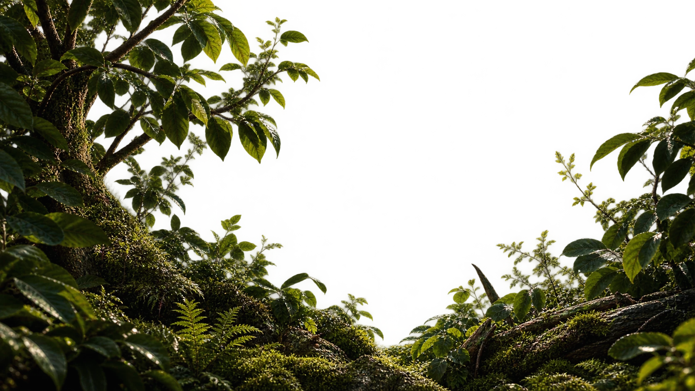</div>

      <div class="leaf leaf--far" aria-hidden="true">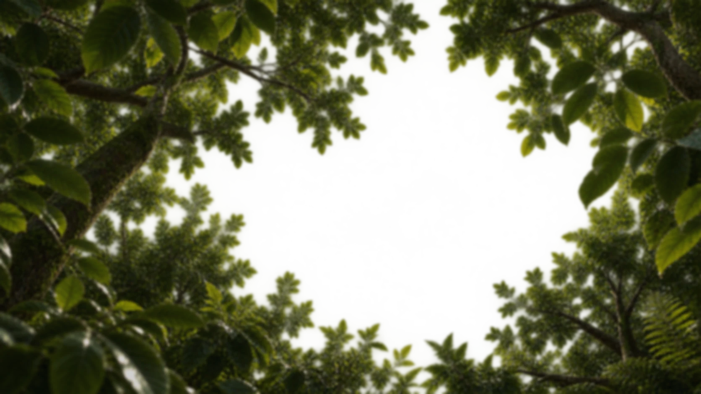</div>

      <a class="hero-bottle" href="product.html?p=five-nine" aria-label="Discover Five-Nine, our woody amber spicy eau de parfum">
        <div class="hero-bottle-in">
          <span class="halo" aria-hidden="true"></span>
          
        </div>
      </a>

      <div class="leaf leaf--l" aria-hidden="true"></div>
      <div class="leaf leaf--r" aria-hidden="true">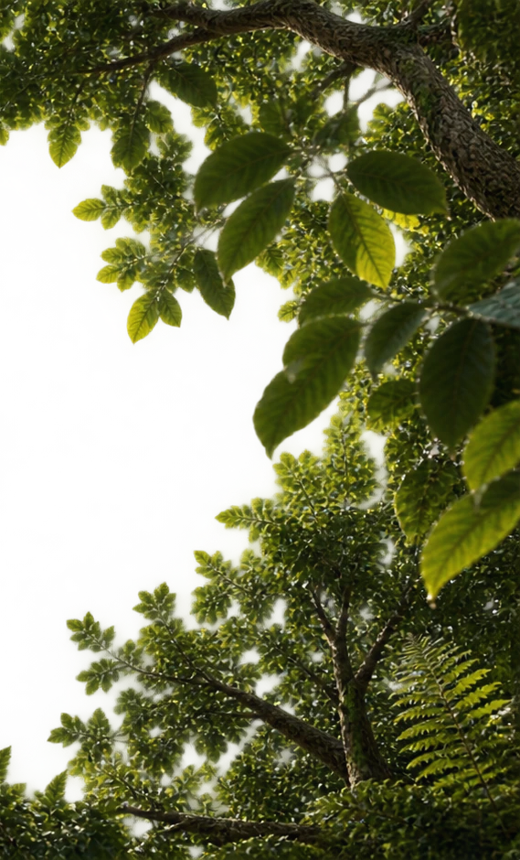</div>
      <div class="leaf leaf--b" aria-hidden="true">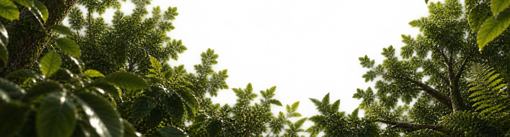</div>
      <canvas class="p-canvas" aria-hidden="true"></canvas>
      <div class="vignette" aria-hidden="true"></div>

      <div class="hero-copy">
        <span class="eyebrow">Ismaeel Muhammad — Eau de Parfum</span>
        <h1 class="display">More than<br>a scent.</h1>
        <div class="journeysub">A journey of senses.</div>
        <p class="body-l">Crafted for those who seek more — timeless fragrances inspired by nature, heritage and emotion.</p>
        <a class="btn" href="#forest">Explore fragrance <span class="arr">→</span></a>
      </div>

      <div class="hero-foot">
        <div class="scrollcue"><span class="line"></span> Scroll to enter</div>
        <div>01 / 06</div>
      </div>
    </div>
  </section>

  <!-- ================================================
       SCENE 02 — THE FOREST EXPERIENCE
       ================================================ -->
  <section class="scene" id="forest" data-rail="02" aria-label="The forest collection">
    <div class="stage">
      <div class="layer forest-bg"></div>
      <div class="forest-frame" aria-hidden="true">
        <div class="layer ff-mid"></div>
        <div class="leaf leaf--far ff-far"></div>
        <div class="leaf leaf--l ff-l"></div>
        <div class="leaf leaf--r ff-r"></div>
        <div class="leaf leaf--b ff-b"></div>
        <div class="fog"></div>
        <div class="sunshaft"></div>
      </div>
      <div class="vignette" aria-hidden="true"></div>
      <div class="stagechip stagechip--hero"><b>02</b> The Forest</div>

      <div class="beats">

        <article class="beat" data-product="five-nine">
          <div class="beat__botanical" aria-hidden="true">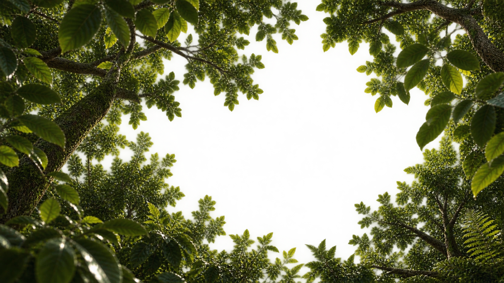</div>
          <div class="bleaf bleaf--b" aria-hidden="true"></div>
          <div class="beat__inner">
            <div class="beat__copy">
              <span class="label">The Forest — <b>01 / 04</b></span>
              <h3 class="display">Five-Nine</h3>
              <div class="beat__family">Woody · Amber · Spicy</div>
              <p class="beat__tag">The forest at golden hour — resin, cedar and warm spice.</p>
              <div class="beat__meta">
                <a class="btn" href="product.html?p=five-nine">Discover <span class="arr">→</span></a>
                <span class="beat__price">from ₨2,600</span>
                <button class="chip-btn" data-add="five-nine">Add to cart</button>
              </div>
            </div>
            <a class="beat__figure" href="product.html?p=five-nine">
              <span class="halo" aria-hidden="true"></span>
              
            </a>
          </div>
          <div class="beat-idx" aria-hidden="true">Five-Nine — Woody · Amber · Spicy</div>
        </article>

        <article class="beat" data-product="hopeful">
          <div class="beat__botanical flip" aria-hidden="true"></div>
          <div class="bleaf bleaf--l" aria-hidden="true"></div>
          <div class="beat__inner">
            <div class="beat__copy">
              <span class="label">The Forest — <b>02 / 04</b></span>
              <h3 class="display">Hopeful</h3>
              <div class="beat__family">Green · Aromatic · Fresh</div>
              <p class="beat__tag">First light through wet leaves — quiet, green, alive.</p>
              <div class="beat__meta">
                <a class="btn" href="product.html?p=hopeful">Discover <span class="arr">→</span></a>
                <span class="beat__price">from ₨2,500</span>
                <button class="chip-btn" data-add="hopeful">Add to cart</button>
              </div>
            </div>
            <a class="beat__figure" href="product.html?p=hopeful">
              <span class="halo" aria-hidden="true"></span>
              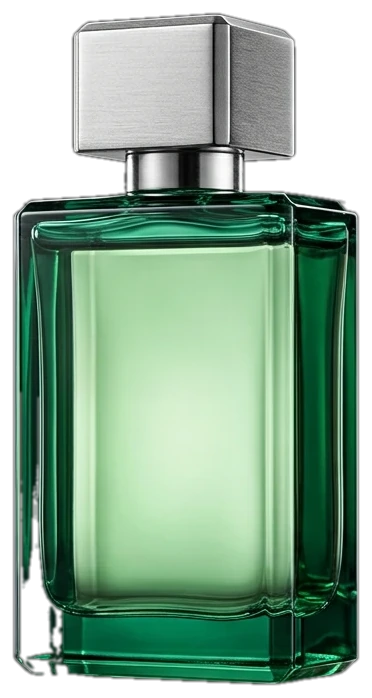
            </a>
          </div>
          <div class="beat-idx" aria-hidden="true">Hopeful — Green · Aromatic · Fresh</div>
        </article>

        <article class="beat" data-product="charming">
          <div class="beat__botanical" aria-hidden="true"></div>
          <div class="bleaf bleaf--r" aria-hidden="true"></div>
          <div class="beat__inner">
            <div class="beat__copy">
              <span class="label">The Forest — <b>03 / 04</b></span>
              <h3 class="display">Charming</h3>
              <div class="beat__family">Woody · Smoky · Citrus</div>
              <p class="beat__tag">Charcoal, cypress and a flash of grapefruit.</p>
              <div class="beat__meta">
                <a class="btn" href="product.html?p=charming">Discover <span class="arr">→</span></a>
                <span class="beat__price">from ₨3,000</span>
                <button class="chip-btn" data-add="charming">Add to cart</button>
              </div>
            </div>
            <a class="beat__figure" href="product.html?p=charming">
              <span class="halo" aria-hidden="true"></span>
              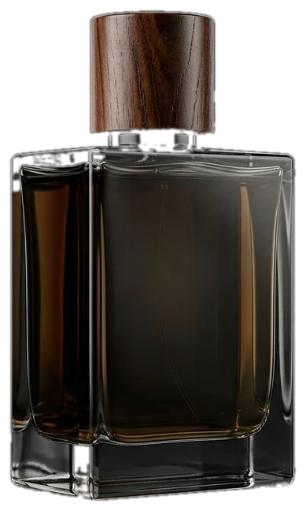
            </a>
          </div>
          <div class="beat-idx" aria-hidden="true">Charming — Woody · Smoky · Citrus</div>
        </article>

        <article class="beat" data-product="mi-amor">
          <div class="beat__botanical flip" aria-hidden="true"></div>
          <div class="bleaf bleaf--n" aria-hidden="true">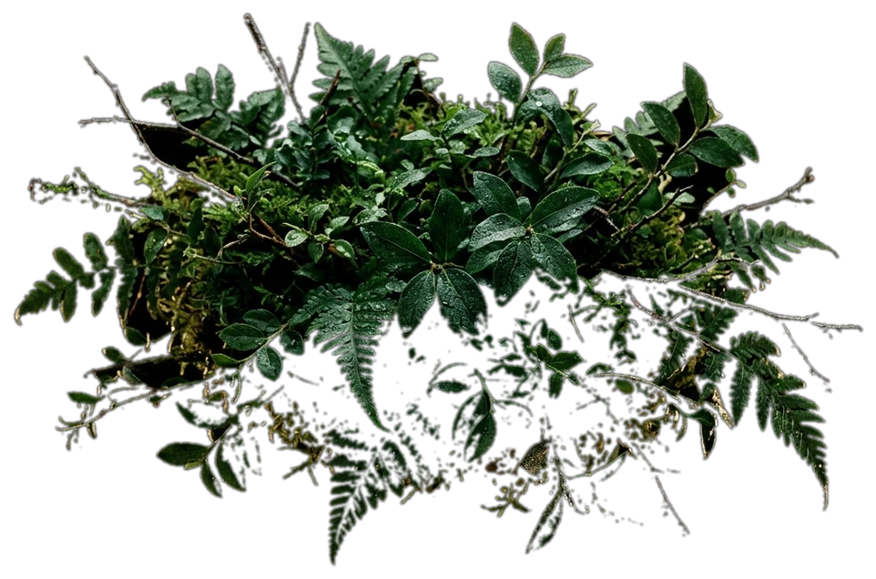</div>
          <div class="beat__inner">
            <div class="beat__copy">
              <span class="label">The Forest — <b>04 / 04</b></span>
              <h3 class="display">Mi Amor</h3>
              <div class="beat__family">Floral · Warm · Musky</div>
              <p class="beat__tag">A rose picked at midnight, wrapped in musk.</p>
              <div class="beat__meta">
                <a class="btn" href="product.html?p=mi-amor">Discover <span class="arr">→</span></a>
                <span class="beat__price">from ₨2,000</span>
                <button class="chip-btn" data-add="mi-amor">Add to cart</button>
              </div>
            </div>
            <a class="beat__figure" href="product.html?p=mi-amor">
              <span class="halo" aria-hidden="true"></span>
              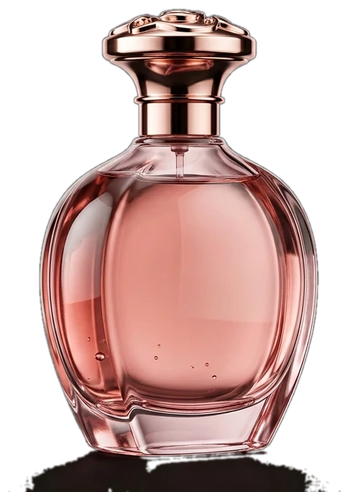
            </a>
          </div>
          <div class="beat-idx" aria-hidden="true">Mi Amor — Floral · Warm · Musky</div>
        </article>

      </div>
    </div>
  </section>

  <!-- ================================================
       SCENE 03 — TRANSITION / FOREST → OPEN LAND → WATER
       ================================================ -->
  <section class="scene" id="transition" data-rail="03" aria-label="From forest to the shore, then under the water">
    <div class="stage">
      <div class="layer trans-beach"></div>
      <div class="water-rise" aria-hidden="true">
        <div class="water-fill">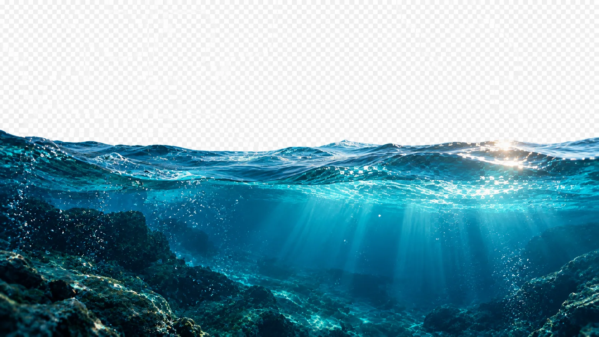</div>
      </div>
      <div class="trans-wash" aria-hidden="true"></div>
      <div class="shore-overlay" aria-hidden="true">
        <div class="bushes"></div>
        <div class="leaves"></div>
      </div>
      <div class="vignette trans-vignette" aria-hidden="true"></div>
      <div class="stagechip"><b>03</b> The Shore</div>

      <div class="trans-copy">
        <div class="tt tt-1">
          <span class="label">The forest opens</span>
          <h2 class="display">Trees give way<br>to the horizon.</h2>
        </div>
        <div class="tt tt-2">
          <span class="label">The shore</span>
          <h2 class="display">Sky, sand<br>and stillness.</h2>
        </div>
        <div class="trans-steps" aria-hidden="true">
          <span class="on">Land</span><i></i><span>Shore</span><i></i><span>Water</span>
        </div>
      </div>
    </div>
  </section>

  <!-- ================================================
       SCENE 04 — THE OCEAN / THE DIVE
       ================================================ -->
  <section class="scene" id="ocean" data-rail="04" aria-label="The dive">
    <div class="stage">
      <div class="layer ocean-water"></div>
      <div class="ocean-dark" aria-hidden="true"></div>
      <div class="ocean-bed-model" aria-hidden="true">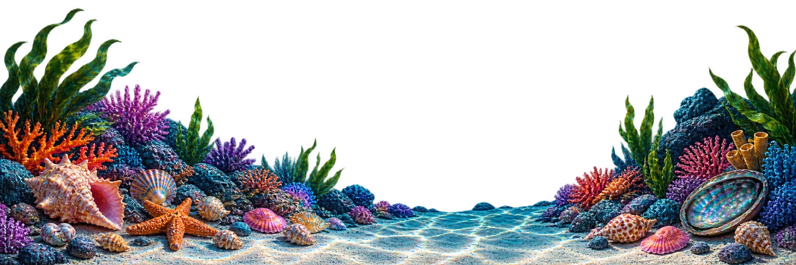</div>
      <div class="rays" aria-hidden="true"></div>
      <div class="caustics" aria-hidden="true"></div>
      <div class="ocean-veil" aria-hidden="true"></div>
      <canvas class="p-canvas" aria-hidden="true"></canvas>
      <div class="vignette" aria-hidden="true"></div>
      <div class="stagechip"><b>04</b> The Sea Bed</div>

      <div class="ocean-head">
        <h2 class="display">Down to the sea bed.</h2>
        <div class="sub">Deeper you go, rarer it becomes</div>
      </div>

      <div class="depthmeter" aria-hidden="true">
        <div class="read">
          <div class="val"><b>0</b><small>M</small></div>
          <div class="lab">Depth</div>
        </div>
        <div class="ruler">
          <i style="top:0%"></i><i style="top:25%"></i><i style="top:50%"></i><i style="top:75%"></i><i style="top:100%"></i>
          <span class="pin" style="top:0%"></span>
        </div>
      </div>

      <div class="beats">

        <article class="beat" data-product="zesty">
          <div class="beat__inner">
            <div class="beat__copy">
              <span class="label">10 metres — <b>the light zone</b></span>
              <h3 class="display">Zesty</h3>
              <div class="beat__family">Citrus · Aquatic · Fresh</div>
              <p class="beat__tag">Salt on skin, sun on water.</p>
              <div class="beat__meta">
                <a class="btn" href="product.html?p=zesty">Discover <span class="arr">→</span></a>
                <span class="beat__price">from ₨2,200</span>
                <button class="chip-btn" data-add="zesty">Add to cart</button>
              </div>
            </div>
            <a class="beat__figure" href="product.html?p=zesty">
              <span class="halo" aria-hidden="true"></span>
              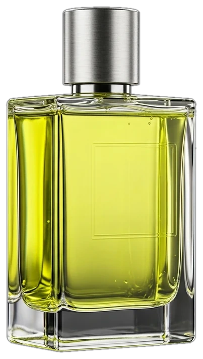
            </a>
          </div>
        </article>

        <article class="beat" data-product="sophisticated">
          <div class="beat__inner">
            <div class="beat__copy">
              <span class="label">20 metres — <b>the blue zone</b></span>
              <h3 class="display">Sophisticated</h3>
              <div class="beat__family">Amber · Leather · Woody</div>
              <p class="beat__tag">Depth, quietly worn.</p>
              <div class="beat__meta">
                <a class="btn" href="product.html?p=sophisticated">Discover <span class="arr">→</span></a>
                <span class="beat__price">from ₨2,800</span>
                <button class="chip-btn" data-add="sophisticated">Add to cart</button>
              </div>
            </div>
            <a class="beat__figure" href="product.html?p=sophisticated">
              <span class="halo" aria-hidden="true"></span>
              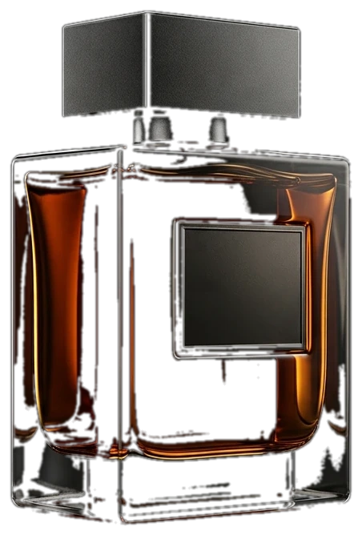
            </a>
          </div>
        </article>

        <article class="beat" data-product="happy">
          <div class="beat__inner">
            <div class="beat__copy">
              <span class="label">30 metres — <b>the dark zone</b></span>
              <h3 class="display">Happy</h3>
              <div class="beat__family">Fruity · Fresh · Sweet</div>
              <p class="beat__tag">Sunlight through blue water.</p>
              <div class="beat__meta">
                <a class="btn" href="product.html?p=happy">Discover <span class="arr">→</span></a>
                <span class="beat__price">from ₨2,200</span>
                <button class="chip-btn" data-add="happy">Add to cart</button>
              </div>
            </div>
            <a class="beat__figure" href="product.html?p=happy">
              <span class="halo" aria-hidden="true"></span>
              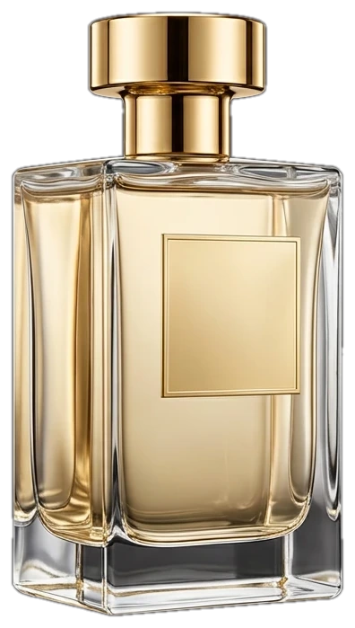
            </a>
          </div>
        </article>

      </div>
    </div>
  </section>

  <!-- ================================================
       SCENE 05 — MOST WANTED / THE DEPTHS
       ================================================ -->
  <section class="scene" id="mostwanted" data-rail="05" aria-label="Most wanted fragrances">
    <div class="stage mw-stage">
      <div class="beam" aria-hidden="true"></div>
      <div class="vignette" aria-hidden="true"></div>
      <div class="stagechip"><b>05</b> The Depths — 40 metres</div>

      <div class="mw-inner">
        <span class="eyebrow">Most Wanted</span>
        <h2 class="display">The depths reveal what people choose most.</h2>
        <div class="sub">The deeper you go, the rarer the fragrance becomes.</div>

        <div class="mw-grid">

          <a class="pcard mw-card" href="product.html?p=king-in-the-north">
            <div class="pcard__media">
              <span class="pcard__badge">Most Wanted</span>
              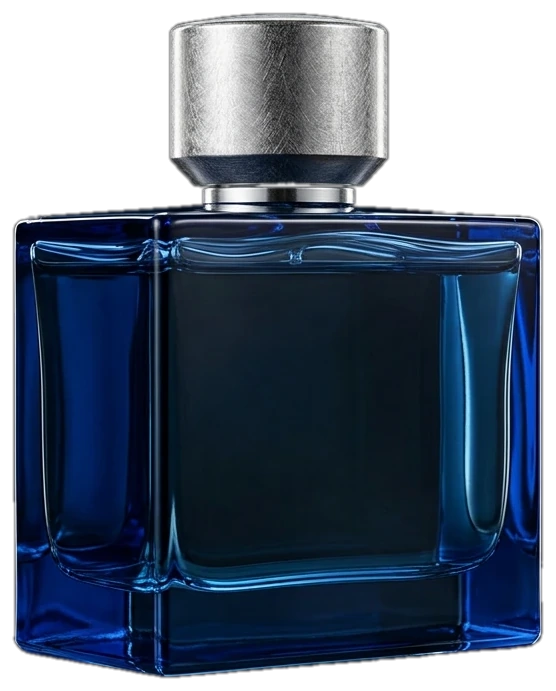
              <span class="pcard__glow" aria-hidden="true"></span>
              <div class="pcard__actions"><button class="chip-btn" data-add="king-in-the-north">Add to cart</button></div>
            </div>
            <div class="pcard__info">
              <div class="pcard__name">King in the North</div>
              <div class="pcard__family">Icy · Smoky · Oud</div>
              <div class="pcard__row"><span class="pcard__price">from ₨3,200</span><span class="pcard__stars">★★★★★</span></div>
            </div>
          </a>

          <a class="pcard mw-card" href="product.html?p=five-nine">
            <div class="pcard__media">
              <span class="pcard__badge">Bestseller</span>
              
              <span class="pcard__glow" aria-hidden="true"></span>
              <div class="pcard__actions"><button class="chip-btn" data-add="five-nine">Add to cart</button></div>
            </div>
            <div class="pcard__info">
              <div class="pcard__name">Five-Nine</div>
              <div class="pcard__family">Woody · Amber · Spicy</div>
              <div class="pcard__row"><span class="pcard__price">from ₨2,600</span><span class="pcard__stars">★★★★★</span></div>
            </div>
          </a>

          <a class="pcard mw-card" href="product.html?p=sophisticated">
            <div class="pcard__media">
              <span class="pcard__badge">Bestseller</span>
              
              <span class="pcard__glow" aria-hidden="true"></span>
              <div class="pcard__actions"><button class="chip-btn" data-add="sophisticated">Add to cart</button></div>
            </div>
            <div class="pcard__info">
              <div class="pcard__name">Sophisticated</div>
              <div class="pcard__family">Amber · Leather · Woody</div>
              <div class="pcard__row"><span class="pcard__price">from ₨2,800</span><span class="pcard__stars">★★★★★</span></div>
            </div>
          </a>

          <a class="pcard mw-card" href="product.html?p=happy">
            <div class="pcard__media">
              
              <span class="pcard__glow" aria-hidden="true"></span>
              <div class="pcard__actions"><button class="chip-btn" data-add="happy">Add to cart</button></div>
            </div>
            <div class="pcard__info">
              <div class="pcard__name">Happy</div>
              <div class="pcard__family">Fruity · Fresh · Sweet</div>
              <div class="pcard__row"><span class="pcard__price">from ₨2,200</span><span class="pcard__stars">★★★★☆</span></div>
            </div>
          </a>

        </div>

        <div class="mw-foot">
          <a class="btn-solid" href="shop.html">View all fragrances</a>
        </div>
      </div>
    </div>
  </section>

  <!-- ================================================
       SCENE 06 — BRAND STORY
       ================================================ -->
  <section class="collections" id="collections" data-rail="06" aria-label="Collections">
    <div class="collections__head" data-reveal>
      <div>
        <span class="eyebrow">Explore</span>
        <h2 class="display">Our <em>collections.</em></h2>
      </div>
      <a class="btn" href="shop.html">Enter the shop <span class="arr">→</span></a>
    </div>

    <div class="portal-grid">
      <a class="portal" href="shop.html?cat=men" data-reveal>
        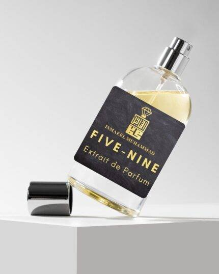
        <span class="veil2"></span>
        <div class="pt">
          <span class="label">For Men</span>
          <h3 class="display">Men</h3>
          <span class="go">Woody &amp; timeless — explore <span class="arr">→</span></span>
        </div>
      </a>
      <a class="portal" href="shop.html?cat=women" data-reveal style="--d:.08s">
        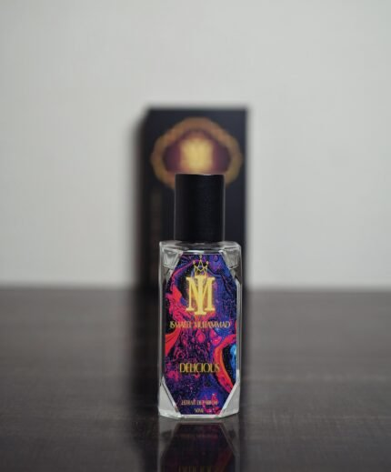
        <span class="veil2"></span>
        <div class="pt">
          <span class="label">For Women</span>
          <h3 class="display">Women</h3>
          <span class="go">Elegant &amp; radiant — explore <span class="arr">→</span></span>
        </div>
      </a>
      <a class="portal" href="#mostwanted" data-reveal style="--d:.16s">
        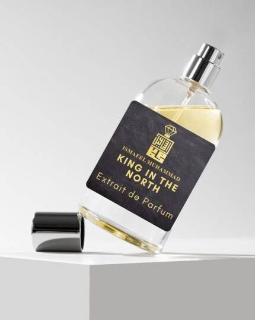
        <span class="veil2"></span>
        <div class="pt">
          <span class="label">40 Metres Down</span>
          <h3 class="display">Most Wanted</h3>
          <span class="go">What people choose most <span class="arr">→</span></span>
        </div>
      </a>
      <a class="portal" href="shop.html?cat=attars" data-reveal>
        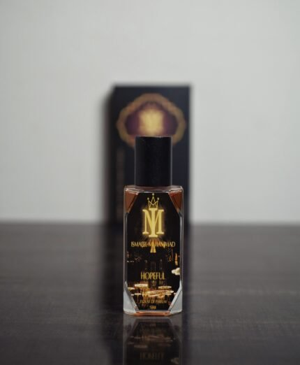
        <span class="veil2"></span>
        <div class="pt">
          <span class="label">Concentrated</span>
          <h3 class="display">Attars</h3>
          <span class="go">The old-world essence <span class="arr">→</span></span>
        </div>
      </a>
      <a class="portal wide" href="shop.html?cat=discovery" data-reveal style="--d:.08s">
        
        <span class="veil2"></span>
        <div class="pt">
          <span class="label">Try Them All</span>
          <h3 class="display">Discovery Set</h3>
          <span class="go">The journey in one box <span class="arr">→</span></span>
        </div>
      </a>
      <a class="portal wide" href="shop.html" data-reveal>
        
        <span class="veil2"></span>
        <div class="pt">
          <span class="label">The Collection</span>
          <h3 class="display">All Fragrances</h3>
          <span class="go">Enter the shop <span class="arr">→</span></span>
        </div>
      </a>
    </div>
  </section>

  <!-- end of journey -->
  <section class="journey-end" aria-label="Continue">
    <div class="waterecho" aria-hidden="true"></div>
    <span class="eyebrow" data-reveal>The journey continues</span>
    <h2 class="display" data-reveal style="--d:.1s">You don't browse Ismaeel Muhammad.<br>You <em>enter</em> it.</h2>
    <a class="btn-solid gold" href="shop.html" data-reveal style="--d:.2s">Shop the collection</a>
  </section>

</main>

<footer class="footer">
  <div class="footer__top">
    <div class="footer__brand">
      <div class="footer__word">Ismaeel<br>Muhammad <em>— a journey of senses</em></div>
      <p class="footer__tag">Timeless fragrances inspired by nature, heritage and emotion. Crafted in Pakistan, worn everywhere.</p>
      <form class="news" id="news-form">
        <input type="email" placeholder="Your email — join the journey" aria-label="Email address" required>
        <button type="submit">Subscribe</button>
      </form>
    </div>
    <div>
      <h4>Shop</h4>
      <ul>
        <li><a href="shop.html">All Fragrances</a></li>
        <li><a href="shop.html?cat=men">Men</a></li>
        <li><a href="shop.html?cat=women">Women</a></li>
      </ul>
    </div>
    <div>
      <h4>House</h4>
      <ul>
        <li><a href="about.html">About</a></li>
        <li><a href="about.html#story">Our Story</a></li>
        <li><a href="index.html#hero">The Journey</a></li>
        <li><a href="contact.html">Contact</a></li>
      </ul>
    </div>
    <div>
      <h4>Support</h4>
      <ul>
        <li><a href="contact.html#faq">FAQ</a></li>
        <li><a href="contact.html#faq">Shipping &amp; Returns</a></li>
        <li><a href="contact.html#faq">Privacy &amp; Terms</a></li>
        <li><a href="checkout.html">Checkout</a></li>
      </ul>
    </div>
  </div>
  <div class="footer__bottom">
    <span>© 2026 Ismaeel Muhammad — All rights reserved</span>
    <span>Forest → Land → Ocean</span>
  </div>
</footer>

<script src="assets/js/data.js"></script>
<script src="assets/vendor/gsap.min.js"></script>
<script src="assets/vendor/ScrollTrigger.min.js"></script>
<script src="assets/vendor/lenis.min.js"></script>
<script src="assets/js/nav.js"></script>
<script src="assets/js/cart.js"></script>
<script src="assets/js/journey.js"></script>
<script>
  document.addEventListener('click', e => {
    const open = e.target.closest('#cart-open, .cart-btn');
    if (open && window.IM) { e.preventDefault(); window.IM.openCart(); }
  });
  const news = document.getElementById('news-form');
  if (news) news.addEventListener('submit', e => {
    e.preventDefault();
    if (window.IM) window.IM.toast('Welcome to the journey');
    news.reset();
  });
</script>
</body>
</html>

```

## 📄 shop.html  ·  (115 lines)

```html
<!DOCTYPE html>
<html lang="en">
<head>
<meta charset="UTF-8">
<meta name="viewport" content="width=device-width, initial-scale=1.0">
<title>Fragrances — Shop | Ismaeel Muhammad</title>
<meta name="description" content="The signature collection of Ismaeel Muhammad — eight Eau de Parfums from the forest to the sea bed. Filter by men and women.">
<link rel="icon" href="assets/img/ui/favicon.svg" type="image/svg+xml">
<link rel="stylesheet" href="assets/css/base.css">
<link rel="stylesheet" href="assets/css/pages.css">
</head>
<body data-page="shop">

<div class="veil" aria-hidden="true">
  <div class="veil__word">Fragrances</div>
  <div class="veil__bar"><i></i></div>
</div>

<nav class="nav" aria-label="Main">
  <a class="nav__logo" href="index.html">Ismaeel <em>Muhammad</em></a>
  <ul class="nav__links">
    <li><a href="index.html" data-nav="journey">Journey</a></li>
    <li><a href="shop.html" data-nav="shop">Shop</a></li>
    <li><a href="about.html" data-nav="about">About</a></li>
    <li><a href="contact.html" data-nav="contact">Contact</a></li>
  </ul>
  <div class="nav__right">
    <button class="cart-btn" id="cart-open" aria-label="Open cart">
      <svg viewBox="0 0 24 24" fill="none" stroke="currentColor" stroke-width="1.4"><path d="M6 7h12l1.2 13H4.8L6 7Z"/><path d="M9 9V6a3 3 0 0 1 6 0v3"/></svg>
      Cart <span class="cart-count" data-empty="1">0</span>
    </button>
    <button class="burger" aria-label="Menu"><span></span><span></span></button>
  </div>
</nav>

<div class="mobile-menu">
  <a href="index.html"><span>Journey</span><span class="no">01</span></a>
  <a href="shop.html"><span>Shop</span><span class="no">02</span></a>
  <a href="about.html"><span>About</span><span class="no">03</span></a>
  <a href="contact.html"><span>Contact</span><span class="no">04</span></a>
  <a href="checkout.html"><span>Checkout</span><span class="no">05</span></a>
</div>

<header class="pagehead">
  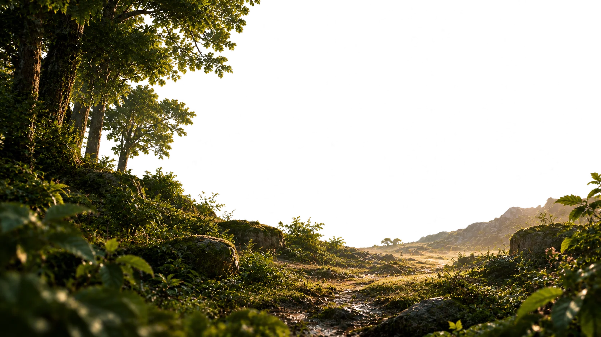
  <div class="pagehead__inner">
    <div class="crumbs"><a href="index.html">Journey</a><i>/</i><span>Fragrances</span></div>
    <span class="eyebrow">The Collection</span>
    <h1 class="display">Every scent from the journey.</h1>
    <p class="sub body-l">From the forest floor to the deep ocean — the full house of Ismaeel Muhammad, in one place.</p>
  </div>
</header>

<div class="shop-tools">
  <div class="shop-tools__in">
    <div class="filters" id="filters" role="tablist" aria-label="Filter fragrances"></div>
    <div class="shop-count" id="shop-count"></div>
  </div>
</div>

<main>
  <div class="shop-grid" id="shop-grid"></div>
</main>

<footer class="footer">
  <div class="footer__top">
    <div class="footer__brand">
      <div class="footer__word">Ismaeel<br>Muhammad <em>— a journey of senses</em></div>
      <p class="footer__tag">Timeless fragrances inspired by nature, heritage and emotion. Crafted in Pakistan, worn everywhere.</p>
    </div>
    <div>
      <h4>Shop</h4>
      <ul>
        <li><a href="shop.html">All Fragrances</a></li>
        <li><a href="shop.html?cat=men">Men</a></li>
        <li><a href="shop.html?cat=women">Women</a></li>
      </ul>
    </div>
    <div>
      <h4>House</h4>
      <ul>
        <li><a href="about.html">About</a></li>
        <li><a href="index.html">The Journey</a></li>
        <li><a href="contact.html">Contact</a></li>
      </ul>
    </div>
    <div>
      <h4>Support</h4>
      <ul>
        <li><a href="contact.html#faq">FAQ</a></li>
        <li><a href="contact.html#faq">Shipping &amp; Returns</a></li>
        <li><a href="checkout.html">Checkout</a></li>
      </ul>
    </div>
  </div>
  <div class="footer__bottom">
    <span>© 2026 Ismaeel Muhammad — All rights reserved</span>
    <span>Forest → Land → Ocean</span>
  </div>
</footer>

<script src="assets/js/data.js"></script>
<script src="assets/vendor/gsap.min.js"></script>
<script src="assets/vendor/ScrollTrigger.min.js"></script>
<script src="assets/js/nav.js"></script>
<script src="assets/js/cart.js"></script>
<script src="assets/js/shop.js"></script>
<script>
  document.addEventListener('click', e => {
    if (e.target.closest('#cart-open, .cart-btn') && window.IM) { e.preventDefault(); window.IM.openCart(); }
  });
</script>
</body>
</html>

```

## 📄 product.html  ·  (195 lines)

```html
<!DOCTYPE html>
<html lang="en">
<head>
<meta charset="UTF-8">
<meta name="viewport" content="width=device-width, initial-scale=1.0">
<title>Fragrance | Ismaeel Muhammad</title>
<meta name="description" content="Discover this fragrance from the Ismaeel Muhammad journey — notes, pyramid, longevity and reviews.">
<link rel="icon" href="assets/img/ui/favicon.svg" type="image/svg+xml">
<link rel="stylesheet" href="assets/css/base.css">
<link rel="stylesheet" href="assets/css/pages.css">
</head>
<body data-page="product">

<div class="veil" aria-hidden="true">
  <div class="veil__word">Ismaeel Muhammad</div>
  <div class="veil__bar"><i></i></div>
</div>

<nav class="nav" aria-label="Main">
  <a class="nav__logo" href="index.html">Ismaeel <em>Muhammad</em></a>
  <ul class="nav__links">
    <li><a href="index.html" data-nav="journey">Journey</a></li>
    <li><a href="shop.html" data-nav="shop">Shop</a></li>
    <li><a href="about.html" data-nav="about">About</a></li>
    <li><a href="contact.html" data-nav="contact">Contact</a></li>
  </ul>
  <div class="nav__right">
    <button class="cart-btn" id="cart-open" aria-label="Open cart">
      <svg viewBox="0 0 24 24" fill="none" stroke="currentColor" stroke-width="1.4"><path d="M6 7h12l1.2 13H4.8L6 7Z"/><path d="M9 9V6a3 3 0 0 1 6 0v3"/></svg>
      Cart <span class="cart-count" data-empty="1">0</span>
    </button>
    <button class="burger" aria-label="Menu"><span></span><span></span></button>
  </div>
</nav>

<div class="mobile-menu">
  <a href="index.html"><span>Journey</span><span class="no">01</span></a>
  <a href="shop.html"><span>Shop</span><span class="no">02</span></a>
  <a href="about.html"><span>About</span><span class="no">03</span></a>
  <a href="contact.html"><span>Contact</span><span class="no">04</span></a>
  <a href="checkout.html"><span>Checkout</span><span class="no">05</span></a>
</div>

<main id="pd-main">

  <!-- hero -->
  <section class="pd">
    <div class="pd__visual">
      
      <div class="envwash" aria-hidden="true"></div>
      <span class="badge" id="pd-badge" hidden></span>
      <div class="pd__bottle"></div>
      <div class="scenechip" id="pd-scenechip"></div>
    </div>

    <div class="pd__info">
      <div class="crumbs" id="pd-crumbs"></div>
      <span class="pd__type" id="pd-type"></span>
      <h1 class="display" id="pd-name"></h1>
      <div class="pd__stars" id="pd-stars"></div>
      <div class="pd__price"><span class="now" id="pd-price"></span></div>
      <p class="pd__tag serif-i" id="pd-tag"></p>
      <p class="pd__desc" id="pd-desc"></p>

      <div class="sizes">
        <span class="label">Size</span>
        <div class="size-row" id="pd-sizes" role="radiogroup" aria-label="Choose size"></div>
      </div>

      <div class="pd__actions">
        <button class="btn-solid gold" id="pd-add">Add to cart</button>
        <button class="btn-solid" id="pd-buy">Buy now</button>
        <button class="btn-solid" id="pd-wish" style="min-width:56px" aria-label="Save to wishlist">♡</button>
      </div>

      <div class="pd__meta" id="pd-meta"></div>
    </div>
  </section>

  <!-- composition -->
  <section class="pdsec pdsec--light" id="composition">
    <div class="pdsec__head" data-reveal>
      <span class="eyebrow">The Composition</span>
      <h2 class="display">Built like a memory — top, heart, base.</h2>
    </div>
    <div class="notes3" id="pd-notes"></div>

    <div class="pyramid" style="margin-top:clamp(56px,9vh,110px)" id="pd-pyramid" data-reveal></div>
  </section>

  <!-- performance -->
  <section class="pdsec pdsec--light" id="performance">
    <div class="pdsec__head" data-reveal>
      <span class="eyebrow">On the Skin</span>
      <h2 class="display">How it wears.</h2>
    </div>
    <div class="perf">
      <div>
        <div class="perf__row" data-reveal>
          <div class="cap"><span>Longevity</span><b id="perf-long-label"></b></div>
          <div class="bar"><i id="perf-long" style="--v:0"></i></div>
        </div>
        <div class="perf__row" data-reveal style="--d:.1s">
          <div class="cap"><span>Projection</span><b id="perf-proj-label"></b></div>
          <div class="bar"><i id="perf-proj" style="--v:0"></i></div>
        </div>
      </div>
      <div data-reveal style="--d:.15s">
        <div class="cap" style="font-size:10.5px;letter-spacing:.3em;text-transform:uppercase;margin-bottom:12px;color:rgba(7,11,8,.6)">When to wear it</div>
        <p class="serif-i" id="pd-wear" style="font-size:clamp(19px,2vw,26px);line-height:1.5;color:#232d20"></p>
      </div>
    </div>
  </section>

  <!-- reviews -->
  <section class="pdsec" id="reviews">
    <div class="pdsec__head" data-reveal>
      <span class="eyebrow">Worn &amp; Remembered</span>
      <h2 class="display">What people say.</h2>
    </div>
    <div class="reviews" id="pd-reviews"></div>
  </section>

  <!-- related -->
  <section class="pdsec" id="related">
    <div class="pdsec__head" data-reveal>
      <span class="eyebrow">Continue Exploring</span>
      <h2 class="display">Related fragrances.</h2>
    </div>
    <div class="related-grid" id="pd-related"></div>
  </section>

  <!-- continue journey -->
  <section class="continue" id="pd-continue">
    
    <div class="continue__in">
      <span class="eyebrow">The journey continues</span>
      <h2 class="display" id="pd-cont-title">Step back into <em>the forest.</em></h2>
      <a class="btn-solid gold" id="pd-cont-link" href="index.html">Continue your journey</a>
    </div>
  </section>

</main>

<footer class="footer">
  <div class="footer__top">
    <div class="footer__brand">
      <div class="footer__word">Ismaeel<br>Muhammad <em>— a journey of senses</em></div>
      <p class="footer__tag">Timeless fragrances inspired by nature, heritage and emotion. Crafted in Pakistan, worn everywhere.</p>
    </div>
    <div>
      <h4>Shop</h4>
      <ul>
        <li><a href="shop.html">All Fragrances</a></li>
        <li><a href="shop.html?cat=men">Men</a></li>
        <li><a href="shop.html?cat=women">Women</a></li>
      </ul>
    </div>
    <div>
      <h4>House</h4>
      <ul>
        <li><a href="about.html">About</a></li>
        <li><a href="index.html">The Journey</a></li>
        <li><a href="contact.html">Contact</a></li>
      </ul>
    </div>
    <div>
      <h4>Support</h4>
      <ul>
        <li><a href="contact.html#faq">FAQ</a></li>
        <li><a href="contact.html#faq">Shipping &amp; Returns</a></li>
        <li><a href="checkout.html">Checkout</a></li>
      </ul>
    </div>
  </div>
  <div class="footer__bottom">
    <span>© 2026 Ismaeel Muhammad — All rights reserved</span>
    <span>Forest → Land → Ocean</span>
  </div>
</footer>

<script src="assets/js/data.js"></script>
<script src="assets/vendor/gsap.min.js"></script>
<script src="assets/vendor/ScrollTrigger.min.js"></script>
<script src="assets/js/nav.js"></script>
<script src="assets/js/cart.js"></script>
<script src="assets/js/product.js"></script>
<script>
  document.addEventListener('click', e => {
    if (e.target.closest('#cart-open, .cart-btn') && window.IM) { e.preventDefault(); window.IM.openCart(); }
  });
</script>
</body>
</html>

```

## 📄 about.html  ·  (183 lines)

```html
<!DOCTYPE html>
<html lang="en">
<head>
<meta charset="UTF-8">
<meta name="viewport" content="width=device-width, initial-scale=1.0">
<title>About — The Story Behind the Scent | Ismaeel Muhammad</title>
<meta name="description" content="The story of Ismaeel Muhammad — how a love of fragrance became a house. The beginning, the passion, the craft, the brand and the future.">
<link rel="icon" href="assets/img/ui/favicon.svg" type="image/svg+xml">
<link rel="stylesheet" href="assets/css/base.css">
<link rel="stylesheet" href="assets/css/pages.css">
</head>
<body data-page="about">

<div class="veil" aria-hidden="true">
  <div class="veil__word">The House</div>
  <div class="veil__bar"><i></i></div>
</div>

<nav class="nav" aria-label="Main">
  <a class="nav__logo" href="index.html">Ismaeel <em>Muhammad</em></a>
  <ul class="nav__links">
    <li><a href="index.html" data-nav="journey">Journey</a></li>
    <li><a href="shop.html" data-nav="shop">Shop</a></li>
    <li><a href="about.html" data-nav="about">About</a></li>
    <li><a href="contact.html" data-nav="contact">Contact</a></li>
  </ul>
  <div class="nav__right">
    <button class="cart-btn" id="cart-open" aria-label="Open cart">
      <svg viewBox="0 0 24 24" fill="none" stroke="currentColor" stroke-width="1.4"><path d="M6 7h12l1.2 13H4.8L6 7Z"/><path d="M9 9V6a3 3 0 0 1 6 0v3"/></svg>
      Cart <span class="cart-count" data-empty="1">0</span>
    </button>
    <button class="burger" aria-label="Menu"><span></span><span></span></button>
  </div>
</nav>

<div class="mobile-menu">
  <a href="index.html"><span>Journey</span><span class="no">01</span></a>
  <a href="shop.html"><span>Shop</span><span class="no">02</span></a>
  <a href="about.html"><span>About</span><span class="no">03</span></a>
  <a href="contact.html"><span>Contact</span><span class="no">04</span></a>
  <a href="checkout.html"><span>Checkout</span><span class="no">05</span></a>
</div>

<header class="pagehead" style="min-height:72vh">
  
  <div class="pagehead__inner">
    <div class="crumbs"><a href="index.html">Journey</a><i>/</i><span>About</span></div>
    <span class="eyebrow">The House of Ismaeel Muhammad</span>
    <h1 class="display">The story behind the scent.</h1>
    <p class="sub body-l">A love of fragrance that would not stay quiet — until it became a house.</p>
  </div>
</header>

<main class="chapters">

  <section class="chapter ch-1" id="story">
    <div>
      <div class="chapter__no" data-reveal>I</div>
      <div class="chapter__copy" data-reveal style="--d:.1s">
        <span class="eyebrow">The Beginning</span>
        <h3 class="display">A boy, a bazaar, a bottle.</h3>
        <p>It started the way most obsessions do — by accident. A market stall, a small bottle of oil perfume, and the realisation that a few drops could carry a memory further than a photograph ever could. That single bottle turned into a habit, the habit into study, and the study into years of learning what makes a fragrance feel like it belongs to someone.</p>
      </div>
    </div>
    <div class="chapter__media" data-reveal style="--d:.15s">
      
    </div>
  </section>

  <section class="chapter ch-2">
    <div class="chapter__media" data-reveal>
      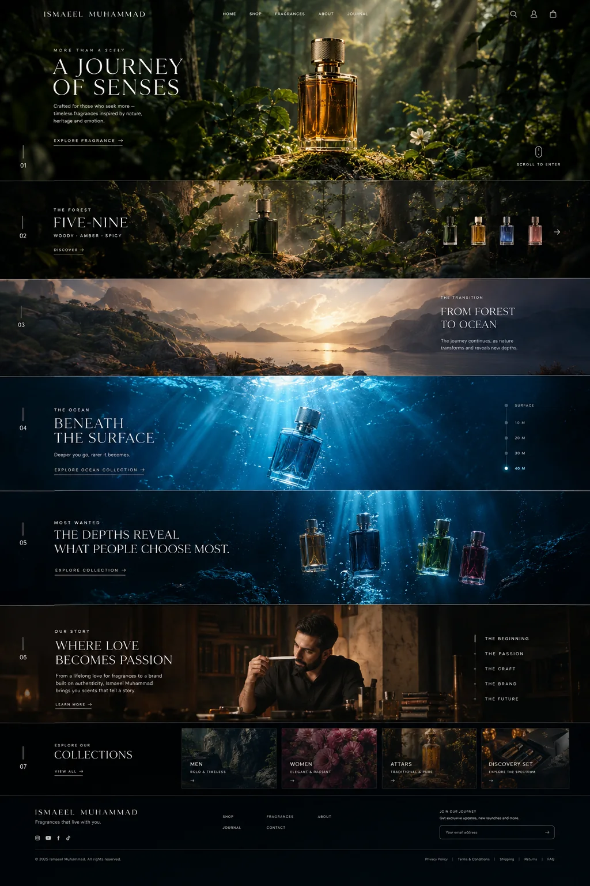
    </div>
    <div>
      <div class="chapter__no" data-reveal>II</div>
      <div class="chapter__copy" data-reveal style="--d:.1s">
        <span class="eyebrow">The Passion</span>
        <h3 class="display">Shared out loud.</h3>
        <p>The passion did not stay in a notebook. It went on camera — reviews, breakdowns, honest opinions about what a fragrance is actually like on skin, in heat, over a full day. An audience grew around that honesty. They did not just watch; they argued, recommended, waited. When the time came to make our own fragrances, that community was already the reason.</p>
      </div>
    </div>
  </section>

  <section class="about-quote">
    <span class="eyebrow" data-reveal>The Philosophy</span>
    <h2 class="display" data-reveal style="--d:.1s">Fragrance isn't simply worn.<br>It is <em>remembered.</em></h2>
  </section>

  <section class="chapter ch-3">
    <div>
      <div class="chapter__no" data-reveal>III</div>
      <div class="chapter__copy" data-reveal style="--d:.1s">
        <span class="eyebrow">The Craft</span>
        <h3 class="display">Nature, patience, precision.</h3>
        <p>Every fragrance in the house begins as a place or a moment — a forest at dawn, water at forty metres — and is built to translate that feeling into notes. Oils are chosen for how they behave on skin through a full day, not how they smell on a strip for five minutes. Nothing ships until it survives the day.</p>
      </div>
    </div>
    <div class="chapter__media" data-reveal style="--d:.15s">
      
    </div>
  </section>

  <section class="chapter ch-4">
    <div class="chapter__media" data-reveal>
      
    </div>
    <div>
      <div class="chapter__no" data-reveal>IV</div>
      <div class="chapter__copy" data-reveal style="--d:.1s">
        <span class="eyebrow">The Brand</span>
        <h3 class="display">A house, not a store.</h3>
        <p>Ismaeel Muhammad is built on a simple belief: in a market flooded with copies, honesty is a luxury. We keep the range tight, the quality stubborn, and the prices fair. From the forest openers to the depths of the ocean line, every bottle is something we would — and do — wear ourselves.</p>
      </div>
    </div>
  </section>

  <section class="chapter ch-1" style="border-bottom:1px solid var(--line)">
    <div>
      <div class="chapter__no" data-reveal>V</div>
      <div class="chapter__copy" data-reveal style="--d:.1s">
        <span class="eyebrow">The Future</span>
        <h3 class="display">The journey has just begun.</h3>
        <p>The forest came first, then the ocean. There are more environments to translate, more stories to bottle, and a community that grows with every release. Wherever the journey goes next, the rule stays the same: more than a scent — a memory.</p>
        <a class="btn" href="index.html" style="margin-top:26px">Take the journey <span class="arr">→</span></a>
      </div>
    </div>
    <div class="chapter__media" data-reveal style="--d:.15s">
      
    </div>
  </section>

</main>

<footer class="footer">
  <div class="footer__top">
    <div class="footer__brand">
      <div class="footer__word">Ismaeel<br>Muhammad <em>— a journey of senses</em></div>
      <p class="footer__tag">Timeless fragrances inspired by nature, heritage and emotion. Crafted in Pakistan, worn everywhere.</p>
    </div>
    <div>
      <h4>Shop</h4>
      <ul>
        <li><a href="shop.html">All Fragrances</a></li>
        <li><a href="shop.html?cat=men">Men</a></li>
        <li><a href="shop.html?cat=women">Women</a></li>
      </ul>
    </div>
    <div>
      <h4>House</h4>
      <ul>
        <li><a href="about.html">About</a></li>
        <li><a href="index.html">The Journey</a></li>
        <li><a href="contact.html">Contact</a></li>
      </ul>
    </div>
    <div>
      <h4>Support</h4>
      <ul>
        <li><a href="contact.html#faq">FAQ</a></li>
        <li><a href="contact.html#faq">Shipping &amp; Returns</a></li>
        <li><a href="checkout.html">Checkout</a></li>
      </ul>
    </div>
  </div>
  <div class="footer__bottom">
    <span>© 2026 Ismaeel Muhammad — All rights reserved</span>
    <span>Forest → Land → Ocean</span>
  </div>
</footer>

<script src="assets/js/data.js"></script>
<script src="assets/vendor/gsap.min.js"></script>
<script src="assets/vendor/ScrollTrigger.min.js"></script>
<script src="assets/js/nav.js"></script>
<script src="assets/js/cart.js"></script>
<script>
  document.addEventListener('click', e => {
    if (e.target.closest('#cart-open, .cart-btn') && window.IM) { e.preventDefault(); window.IM.openCart(); }
  });
</script>
</body>
</html>

```

## 📄 contact.html  ·  (177 lines)

```html
<!DOCTYPE html>
<html lang="en">
<head>
<meta charset="UTF-8">
<meta name="viewport" content="width=device-width, initial-scale=1.0">
<title>Contact — Let's Talk | Ismaeel Muhammad</title>
<meta name="description" content="Questions about your fragrance? Talk to the house of Ismaeel Muhammad — customer support, wholesale and press.">
<link rel="icon" href="assets/img/ui/favicon.svg" type="image/svg+xml">
<link rel="stylesheet" href="assets/css/base.css">
<link rel="stylesheet" href="assets/css/pages.css">
</head>
<body data-page="contact">

<div class="veil" aria-hidden="true">
  <div class="veil__word">Let's Talk</div>
  <div class="veil__bar"><i></i></div>
</div>

<nav class="nav" aria-label="Main">
  <a class="nav__logo" href="index.html">Ismaeel <em>Muhammad</em></a>
  <ul class="nav__links">
    <li><a href="index.html" data-nav="journey">Journey</a></li>
    <li><a href="shop.html" data-nav="shop">Shop</a></li>
    <li><a href="about.html" data-nav="about">About</a></li>
    <li><a href="contact.html" data-nav="contact">Contact</a></li>
  </ul>
  <div class="nav__right">
    <button class="cart-btn" id="cart-open" aria-label="Open cart">
      <svg viewBox="0 0 24 24" fill="none" stroke="currentColor" stroke-width="1.4"><path d="M6 7h12l1.2 13H4.8L6 7Z"/><path d="M9 9V6a3 3 0 0 1 6 0v3"/></svg>
      Cart <span class="cart-count" data-empty="1">0</span>
    </button>
    <button class="burger" aria-label="Menu"><span></span><span></span></button>
  </div>
</nav>

<div class="mobile-menu">
  <a href="index.html"><span>Journey</span><span class="no">01</span></a>
  <a href="shop.html"><span>Shop</span><span class="no">02</span></a>
  <a href="about.html"><span>About</span><span class="no">03</span></a>
  <a href="contact.html"><span>Contact</span><span class="no">04</span></a>
  <a href="checkout.html"><span>Checkout</span><span class="no">05</span></a>
</div>

<main class="contact">
  <div class="contact__grid">
    <div>
      <div class="crumbs"><a href="index.html">Journey</a><i>/</i><span>Contact</span></div>
      <span class="eyebrow">Contact</span>
      <h1 class="display">Let's talk.</h1>
      <p class="contact__lead">Questions about your fragrance, your order, or where to begin the journey — write to us. A human answers, usually within a day.</p>

      <div class="contact__blocks">
        <div class="cblock">
          <span class="label">Email</span>
          <div><a href="mailto:hello@ismaeelmuhammad.pk">hello@ismaeelmuhammad.pk</a></div>
        </div>
        <div class="cblock">
          <span class="label">Customer Support</span>
          <p>Monday – Saturday, 10:00 – 20:00 PKT<br>Response within 24 hours</p>
        </div>
        <div class="cblock">
          <span class="label">Social</span>
          <p><a href="#" rel="noopener">YouTube</a> · <a href="#" rel="noopener">Instagram</a> · <a href="#" rel="noopener">TikTok</a></p>
        </div>
        <div class="cblock">
          <span class="label">Location</span>
          <p>Pakistan — shipping nationwide<br>and worldwide</p>
        </div>
      </div>
    </div>

    <form class="cform" id="contact-form" novalidate>
      <h3 class="display">Write to the house.</h3>
      <div class="f-2col">
        <div class="f-row">
          <label for="cf-name">Your name</label>
          <input id="cf-name" type="text" required autocomplete="name">
        </div>
        <div class="f-row">
          <label for="cf-email">Email</label>
          <input id="cf-email" type="email" required autocomplete="email">
        </div>
      </div>
      <div class="f-row">
        <label for="cf-subject">Subject</label>
        <select id="cf-subject">
          <option>A question about a fragrance</option>
          <option>My order</option>
          <option>Wholesale / retail</option>
          <option>Press &amp; collaborations</option>
          <option>Something else</option>
        </select>
      </div>
      <div class="f-row">
        <label for="cf-msg">Message</label>
        <textarea id="cf-msg" required></textarea>
      </div>
      <button class="btn-solid gold" type="submit">Send message</button>
      <div class="form-ok" id="form-ok">
        <p class="display">Thank you.</p>
        <p>Your message is on its way. We reply within one working day.</p>
      </div>
    </form>
  </div>

  <!-- FAQ -->
  <section id="faq" style="max-width:860px;margin-top:clamp(60px,10vh,120px)">
    <span class="eyebrow" data-reveal>Support</span>
    <h2 class="display" data-reveal style="--d:.08s;margin:16px 0 30px">Questions, answered.</h2>
    <div class="contact__blocks" data-reveal style="--d:.14s">
      <div class="cblock"><span class="label">Shipping</span><p>Orders dispatch within 1–2 working days. Nationwide delivery in 2–5 days; free over ₨5,000. International shipping is calculated at checkout.</p></div>
      <div class="cblock"><span class="label">Returns</span><p>Unopened bottles may be returned within 7 days of delivery. If a fragrance arrives damaged, send a photo and we replace it — no questions.</p></div>
      <div class="cblock"><span class="label">Payment</span><p>Cash on delivery across Pakistan, bank transfer, and card payments at checkout.</p></div>
      <div class="cblock"><span class="label">Which fragrance should I start with?</span><p>Start where the journey begins — Five-Nine, the forest at golden hour — or let the Most Wanted depths decide for you.</p></div>
      <div class="cblock"><span class="label">Privacy &amp; Terms</span><p>We keep only what we need to deliver your order, and never share it. Full privacy policy and terms are available on request at hello@ismaeelmuhammad.pk.</p></div>
    </div>
  </section>
</main>

<footer class="footer">
  <div class="footer__top">
    <div class="footer__brand">
      <div class="footer__word">Ismaeel<br>Muhammad <em>— a journey of senses</em></div>
      <p class="footer__tag">Timeless fragrances inspired by nature, heritage and emotion. Crafted in Pakistan, worn everywhere.</p>
    </div>
    <div>
      <h4>Shop</h4>
      <ul>
        <li><a href="shop.html">All Fragrances</a></li>
        <li><a href="shop.html?cat=men">Men</a></li>
        <li><a href="shop.html?cat=women">Women</a></li>
      </ul>
    </div>
    <div>
      <h4>House</h4>
      <ul>
        <li><a href="about.html">About</a></li>
        <li><a href="index.html">The Journey</a></li>
        <li><a href="contact.html">Contact</a></li>
      </ul>
    </div>
    <div>
      <h4>Support</h4>
      <ul>
        <li><a href="contact.html#faq">FAQ</a></li>
        <li><a href="contact.html#faq">Shipping &amp; Returns</a></li>
        <li><a href="checkout.html">Checkout</a></li>
      </ul>
    </div>
  </div>
  <div class="footer__bottom">
    <span>© 2026 Ismaeel Muhammad — All rights reserved</span>
    <span>Forest → Land → Ocean</span>
  </div>
</footer>

<script src="assets/js/data.js"></script>
<script src="assets/vendor/gsap.min.js"></script>
<script src="assets/vendor/ScrollTrigger.min.js"></script>
<script src="assets/js/nav.js"></script>
<script src="assets/js/cart.js"></script>
<script>
  document.addEventListener('click', e => {
    if (e.target.closest('#cart-open, .cart-btn') && window.IM) { e.preventDefault(); window.IM.openCart(); }
  });
  const form = document.getElementById('contact-form');
  form.addEventListener('submit', e => {
    e.preventDefault();
    if (!form.checkValidity()) { form.reportValidity(); return; }
    form.querySelectorAll('.f-row, .btn-solid').forEach(el => el.style.display = 'none');
    document.getElementById('form-ok').style.display = 'block';
    if (window.IM) window.IM.toast('Message sent — thank you');
  });
</script>
</body>
</html>

```

## 📄 checkout.html  ·  (221 lines)

```html
<!DOCTYPE html>
<html lang="en">
<head>
<meta charset="UTF-8">
<meta name="viewport" content="width=device-width, initial-scale=1.0">
<title>Checkout | Ismaeel Muhammad</title>
<meta name="description" content="Complete your order — Ismaeel Muhammad fragrance house. Cash on delivery, bank transfer and card payments.">
<link rel="icon" href="assets/img/ui/favicon.svg" type="image/svg+xml">
<link rel="stylesheet" href="assets/css/base.css">
<link rel="stylesheet" href="assets/css/pages.css">
</head>
<body data-page="checkout">

<div class="veil" aria-hidden="true">
  <div class="veil__word">Checkout</div>
  <div class="veil__bar"><i></i></div>
</div>

<nav class="nav" aria-label="Main">
  <a class="nav__logo" href="index.html">Ismaeel <em>Muhammad</em></a>
  <ul class="nav__links">
    <li><a href="index.html" data-nav="journey">Journey</a></li>
    <li><a href="shop.html" data-nav="shop">Shop</a></li>
    <li><a href="about.html" data-nav="about">About</a></li>
    <li><a href="contact.html" data-nav="contact">Contact</a></li>
  </ul>
  <div class="nav__right">
    <button class="cart-btn" id="cart-open" aria-label="Open cart">
      <svg viewBox="0 0 24 24" fill="none" stroke="currentColor" stroke-width="1.4"><path d="M6 7h12l1.2 13H4.8L6 7Z"/><path d="M9 9V6a3 3 0 0 1 6 0v3"/></svg>
      Cart <span class="cart-count" data-empty="1">0</span>
    </button>
    <button class="burger" aria-label="Menu"><span></span><span></span></button>
  </div>
</nav>

<div class="mobile-menu">
  <a href="index.html"><span>Journey</span><span class="no">01</span></a>
  <a href="shop.html"><span>Shop</span><span class="no">02</span></a>
  <a href="about.html"><span>About</span><span class="no">03</span></a>
  <a href="contact.html"><span>Contact</span><span class="no">04</span></a>
  <a href="checkout.html"><span>Checkout</span><span class="no">05</span></a>
</div>

<main class="checkout">
  <div id="co-flow">
    <div class="crumbs"><a href="shop.html">Shop</a><i>/</i><span>Checkout</span></div>
    <span class="eyebrow">Secure Checkout</span>
    <h1 class="display">Almost yours.</h1>

    <div class="checkout__grid">
      <form id="co-form" novalidate>
        <div class="co-card">
          <span class="label">01 — Contact</span>
          <div class="f-2col">
            <div class="f-row">
              <label for="co-name">Full name</label>
              <input id="co-name" type="text" required autocomplete="name">
            </div>
            <div class="f-row">
              <label for="co-phone">Phone</label>
              <input id="co-phone" type="tel" required autocomplete="tel" placeholder="03XX-XXXXXXX">
            </div>
          </div>
          <div class="f-row">
            <label for="co-email">Email</label>
            <input id="co-email" type="email" required autocomplete="email">
          </div>
        </div>

        <div class="co-card">
          <span class="label">02 — Shipping address</span>
          <div class="f-row">
            <label for="co-addr">Street address</label>
            <input id="co-addr" type="text" required autocomplete="street-address">
          </div>
          <div class="f-2col">
            <div class="f-row">
              <label for="co-city">City</label>
              <input id="co-city" type="text" required autocomplete="address-level2">
            </div>
            <div class="f-row">
              <label for="co-postal">Postal code (optional)</label>
              <input id="co-postal" type="text" autocomplete="postal-code">
            </div>
          </div>
        </div>

        <div class="co-card">
          <span class="label">03 — Payment</span>
          <label class="pay-opt on">
            <input type="radio" name="pay" value="cod" checked>
            <span><b>Cash on Delivery</b><span>Pay the courier when your fragrance arrives — available across Pakistan.</span></span>
          </label>
          <label class="pay-opt">
            <input type="radio" name="pay" value="bank">
            <span><b>Bank Transfer</b><span>Details sent with your order confirmation.</span></span>
          </label>
          <label class="pay-opt">
            <input type="radio" name="pay" value="card">
            <span><b>Card</b><span>Debit / credit card at confirmation (demo).</span></span>
          </label>
        </div>

        <button class="btn-solid gold" type="submit" style="width:100%">Place order</button>
        <p style="font-size:10px;letter-spacing:.2em;text-transform:uppercase;color:rgba(242,238,227,.4);text-align:center;margin-top:16px">
          Encrypted · 7-day returns · A human packs every order
        </p>
      </form>

      <aside class="summary">
        <span class="label">Order Summary</span>
        <div id="co-items"></div>
        <div class="cart__row"><span>Subtotal</span><b id="co-sub"></b></div>
        <div class="cart__row"><span>Shipping</span><b id="co-ship"></b></div>
        <div class="cart__row total"><span>Total</span><b id="co-tot"></b></div>
      </aside>
    </div>
  </div>

  <div id="co-done" hidden>
    <div class="co-success">
      <span class="eyebrow">Order Confirmed</span>
      <h2 class="display">The journey is on its way.</h2>
      <div class="ord" id="co-ref">Order IM-0000</div>
      <p>Thank you. A confirmation is on its way to your inbox. Your fragrance will be dispatched within 1–2 working days.</p>
      <a class="btn-solid gold" href="index.html" style="margin-top:30px">Back to the journey</a>
    </div>
  </div>
</main>

<footer class="footer">
  <div class="footer__top">
    <div class="footer__brand">
      <div class="footer__word">Ismaeel<br>Muhammad <em>— a journey of senses</em></div>
      <p class="footer__tag">Timeless fragrances inspired by nature, heritage and emotion. Crafted in Pakistan, worn everywhere.</p>
    </div>
    <div>
      <h4>Shop</h4>
      <ul>
        <li><a href="shop.html">All Fragrances</a></li>
        <li><a href="shop.html?cat=men">Men</a></li>
        <li><a href="shop.html?cat=women">Women</a></li>
      </ul>
    </div>
    <div>
      <h4>House</h4>
      <ul>
        <li><a href="about.html">About</a></li>
        <li><a href="index.html">The Journey</a></li>
        <li><a href="contact.html">Contact</a></li>
      </ul>
    </div>
    <div>
      <h4>Support</h4>
      <ul>
        <li><a href="contact.html#faq">FAQ</a></li>
        <li><a href="contact.html#faq">Shipping &amp; Returns</a></li>
        <li><a href="contact.html">Contact</a></li>
      </ul>
    </div>
  </div>
  <div class="footer__bottom">
    <span>© 2026 Ismaeel Muhammad — All rights reserved</span>
    <span>Forest → Land → Ocean</span>
  </div>
</footer>

<script src="assets/js/data.js"></script>
<script src="assets/vendor/gsap.min.js"></script>
<script src="assets/vendor/ScrollTrigger.min.js"></script>
<script src="assets/js/nav.js"></script>
<script src="assets/js/cart.js"></script>
<script>
  document.addEventListener('click', e => {
    if (e.target.closest('#cart-open, .cart-btn') && window.IM) { e.preventDefault(); window.IM.openCart(); }
  });

  document.querySelectorAll('.pay-opt').forEach(opt => {
    opt.addEventListener('click', () => {
      document.querySelectorAll('.pay-opt').forEach(o => o.classList.remove('on'));
      opt.classList.add('on');
      opt.querySelector('input').checked = true;
    });
  });

  function renderSummary() {
    const items = window.IM.cart.items;
    const box = document.getElementById('co-items');
    if (items.length === 0) {
      box.innerHTML = '<p style="color:rgba(242,238,227,.5);font-size:13.5px">Your cart is empty — <a href="shop.html" style="color:var(--gold)">choose a fragrance</a> first.</p>';
    } else {
      box.innerHTML = items.map(i => {
        const p = bySlug(i.slug);
        return `<div class="s-item">
          <div class="th"></div>
          <div><div class="nm">${p.name}</div><div class="mt">${p.type} · ${i.size} × ${i.qty}</div></div>
          <div class="pr">${fmtPrice(window.IM.cart.lineTotal(i))}</div>
        </div>`;
      }).join('');
    }
    document.getElementById('co-sub').textContent = fmtPrice(window.IM.cart.subtotal());
    document.getElementById('co-ship').textContent = items.length === 0 ? '—' : (window.IM.cart.shipping() === 0 ? 'Free' : fmtPrice(window.IM.cart.shipping()));
    document.getElementById('co-tot').textContent = fmtPrice(window.IM.cart.total());
  }
  renderSummary();

  document.getElementById('co-form').addEventListener('submit', e => {
    e.preventDefault();
    const form = e.target;
    if (!form.checkValidity()) { form.reportValidity(); return; }
    if (window.IM.cart.items.length === 0) { window.IM.toast('Your cart is empty'); return; }
    document.getElementById('co-ref').textContent = 'Order IM-' + Math.floor(1000 + Math.random() * 9000);
    document.getElementById('co-flow').hidden = true;
    document.getElementById('co-done').hidden = false;
    window.scrollTo({ top: 0, behavior: 'smooth' });
    window.IM.cart.clear();
  });
</script>
</body>
</html>

```

## 📄 assets/css/base.css  ·  (446 lines)

```css
/* ============================================================
   ISMAEEL MUHAMMAD — base design system
   ============================================================ */

@font-face { font-family:'Playfair Display'; src:url('../fonts/playfair-display-latin-700-normal.woff2') format('woff2'); font-weight:700; font-style:normal; font-display:swap; }
@font-face { font-family:'Playfair Display'; src:url('../fonts/playfair-display-latin-900-normal.woff2') format('woff2'); font-weight:900; font-style:normal; font-display:swap; }
@font-face { font-family:'Playfair Display'; src:url('../fonts/playfair-display-latin-700-italic.woff2') format('woff2'); font-weight:700; font-style:italic; font-display:swap; }
@font-face { font-family:'Cormorant Garamond'; src:url('../fonts/cormorant-garamond-latin-300-normal.woff2') format('woff2'); font-weight:300; font-style:normal; font-display:swap; }
@font-face { font-family:'Cormorant Garamond'; src:url('../fonts/cormorant-garamond-latin-400-normal.woff2') format('woff2'); font-weight:400; font-style:normal; font-display:swap; }
@font-face { font-family:'Cormorant Garamond'; src:url('../fonts/cormorant-garamond-latin-500-normal.woff2') format('woff2'); font-weight:500; font-style:normal; font-display:swap; }
@font-face { font-family:'Cormorant Garamond'; src:url('../fonts/cormorant-garamond-latin-600-normal.woff2') format('woff2'); font-weight:600; font-style:normal; font-display:swap; }
@font-face { font-family:'Cormorant Garamond'; src:url('../fonts/cormorant-garamond-latin-400-italic.woff2') format('woff2'); font-weight:400; font-style:italic; font-display:swap; }
@font-face { font-family:'Cormorant Garamond'; src:url('../fonts/cormorant-garamond-latin-500-italic.woff2') format('woff2'); font-weight:500; font-style:italic; font-display:swap; }
@font-face { font-family:'Inter'; src:url('../fonts/inter-latin-300-normal.woff2') format('woff2'); font-weight:300; font-display:swap; }
@font-face { font-family:'Inter'; src:url('../fonts/inter-latin-400-normal.woff2') format('woff2'); font-weight:400; font-display:swap; }
@font-face { font-family:'Inter'; src:url('../fonts/inter-latin-500-normal.woff2') format('woff2'); font-weight:500; font-display:swap; }
@font-face { font-family:'Inter'; src:url('../fonts/inter-latin-600-normal.woff2') format('woff2'); font-weight:600; font-display:swap; }

:root{
  --serif:'Cormorant Garamond', Georgia, 'Times New Roman', serif;
  --sans:'Inter', -apple-system, 'Segoe UI', Helvetica, Arial, sans-serif;

  --ink:#070b08;
  --paper:#f2eee3;
  --paper-dim:#d9d4c5;
  --charcoal:#0e1112;
  --charcoal-2:#16191a;

  --forest-1:#07130d; --forest-2:#18291c; --forest-3:#405b42;
  --ocean-1:#0a2330;  --ocean-2:#063e59;  --ocean-3:#087c9c;
  --deep:#030d16;
  --sand:#c5c4b5; --stone:#87908a;
  --gold:#c9a86a; --gold-soft:rgba(201,168,106,.55);
  --mist:rgba(214,226,214,.16);

  --line:rgba(242,238,227,.16);
  --line-dark:rgba(7,11,8,.16);

  --nav-h:76px;
  --ease:cubic-bezier(.22,1,.36,1);
  --pad:clamp(20px,4.5vw,72px);
}

*,*::before,*::after{ box-sizing:border-box; margin:0; padding:0; }
html{ scroll-behavior:smooth; }
html.lenis, html.lenis body{ height:auto; }
.lenis.lenis-smooth{ scroll-behavior:auto !important; }

body{
  background:var(--ink);
  color:var(--paper);
  font-family:var(--sans);
  font-weight:300;
  font-size:16px;
  line-height:1.7;
  -webkit-font-smoothing:antialiased;
  overflow-x:hidden;
  min-height:100vh;
}
body.is-locked{ overflow:hidden; }

img{ display:block; max-width:100%; }
a{ color:inherit; text-decoration:none; }
button{ font-family:inherit; color:inherit; background:none; border:0; cursor:pointer; }
input,textarea,select{ font-family:inherit; font-size:inherit; }
::selection{ background:var(--gold); color:#100c04; }

:focus-visible{ outline:1.5px solid var(--gold); outline-offset:3px; border-radius:2px; }

/* ---------- typography ---------- */
.display{
  font-family:'Playfair Display', var(--serif); font-weight:700;
  line-height:1.02; letter-spacing:-.012em;
  text-wrap:balance;
}
.display em{ font-style:italic; }
h1.display{ font-size:clamp(52px,9vw,148px); font-weight:900; letter-spacing:-.02em; }
h2.display{ font-size:clamp(36px,5.8vw,84px); }
h3.display{ font-size:clamp(28px,3.6vw,50px); }
.eyebrow{
  font-family:var(--sans); font-size:11px; font-weight:600;
  letter-spacing:.42em; text-transform:uppercase; color:var(--gold);
}
.eyebrow::before{
  content:''; display:inline-block; width:26px; height:1px;
  background:var(--gold); margin-right:14px; vertical-align:middle; opacity:.8;
}
.label{
  font-size:11px; font-weight:500; letter-spacing:.34em; text-transform:uppercase;
}
.body-l{ font-size:clamp(15px,1.35vw,18px); color:rgba(242,238,227,.78); }
.i{ font-style:italic; font-family:var(--serif); }
.serif-i{ font-family:var(--serif); font-style:italic; font-weight:400; }

/* ---------- layout helpers ---------- */
.wrap{ padding-inline:var(--pad); }
.section{ position:relative; }
.rule{ height:1px; background:var(--line); border:0; }

/* ---------- buttons ---------- */
.btn{
  position:relative; display:inline-flex; align-items:center; gap:14px;
  font-size:11px; font-weight:600; letter-spacing:.34em; text-transform:uppercase;
  color:var(--paper); padding:6px 2px;
  transition:color .45s var(--ease);
}
.btn .arr{ display:inline-block; transition:transform .45s var(--ease); }
.btn::after{
  content:''; position:absolute; left:0; bottom:0; height:1px; width:100%;
  background:currentColor; opacity:.4;
  transform:scaleX(1); transform-origin:right;
  transition:transform .55s var(--ease), opacity .4s;
}
.btn:hover{ color:var(--gold); }
.btn:hover::after{ transform:scaleX(.35); opacity:.9; }
.btn:hover .arr{ transform:translateX(8px); }

.btn-solid{
  display:inline-flex; align-items:center; justify-content:center; gap:12px;
  min-height:56px; padding:0 38px;
  font-size:11px; font-weight:500; letter-spacing:.34em; text-transform:uppercase;
  border:1px solid var(--line);
  background:transparent; color:var(--paper);
  transition:background .5s var(--ease), border-color .5s var(--ease), color .5s var(--ease);
}
.btn-solid:hover{ background:var(--paper); color:var(--ink); border-color:var(--paper); }
.btn-solid.gold{ border-color:var(--gold-soft); color:var(--gold); }
.btn-solid.gold:hover{ background:var(--gold); border-color:var(--gold); color:#171004; }
.btn-solid:disabled{ opacity:.4; pointer-events:none; }

/* ---------- reveal on scroll (applied only when JS allows) ---------- */
.js-anim [data-reveal]{ opacity:0; transform:translateY(34px); }
.js-anim [data-reveal].revealed{
  opacity:1; transform:none;
  transition:opacity 1s var(--ease), transform 1s var(--ease);
  transition-delay:var(--d,0s);
}

/* ============================================================
   NAVIGATION
   ============================================================ */
.nav{
  position:fixed; inset:0 0 auto 0; z-index:200;
  height:var(--nav-h);
  display:flex; align-items:center; justify-content:space-between;
  padding-inline:var(--pad);
  color:var(--paper);
  transition:background .6s var(--ease), backdrop-filter .6s, border-color .6s;
  border-bottom:1px solid transparent;
}
.nav.scrolled{
  background:rgba(7,11,8,.72);
  backdrop-filter:blur(14px);
  -webkit-backdrop-filter:blur(14px);
  border-bottom-color:var(--line);
}
.nav--light.scrolled{ background:rgba(240,236,225,.86); color:var(--ink); border-bottom-color:var(--line-dark); }

.nav__logo{
  font-family:var(--serif); font-weight:500;
  font-size:clamp(15px,1.6vw,20px); letter-spacing:.34em; text-transform:uppercase;
  white-space:nowrap;
}
.nav__logo em{ font-style:normal; color:var(--gold); }
.nav__links{ display:flex; gap:clamp(18px,2.6vw,40px); list-style:none; }
.nav__links a{
  position:relative; font-size:10.5px; font-weight:500;
  letter-spacing:.3em; text-transform:uppercase; opacity:.82;
  padding:6px 0; transition:opacity .4s, color .4s;
}
.nav__links a::after{
  content:''; position:absolute; left:0; bottom:0; width:100%; height:1px;
  background:var(--gold); transform:scaleX(0); transform-origin:left;
  transition:transform .45s var(--ease);
}
.nav__links a:hover{ opacity:1; color:var(--gold); }
.nav__links a:hover::after{ transform:scaleX(1); }
.nav__right{ display:flex; align-items:center; gap:clamp(14px,2vw,26px); }

.cart-btn{
  position:relative; display:inline-flex; align-items:center; gap:10px;
  font-size:10.5px; font-weight:500; letter-spacing:.3em; text-transform:uppercase;
  opacity:.9; transition:color .4s;
}
.cart-btn:hover{ color:var(--gold); }
.cart-btn svg{ width:17px; height:17px; }
.cart-count{
  min-width:18px; height:18px; padding:0 4px; border-radius:9px;
  display:inline-flex; align-items:center; justify-content:center;
  background:var(--gold); color:#171004;
  font-size:10px; font-weight:600; letter-spacing:0;
}
.cart-count[data-empty="1"]{ display:none; }

.burger{ display:none; width:40px; height:40px; position:relative; z-index:220; }
.burger span{
  position:absolute; left:9px; right:9px; height:1.5px; background:currentColor;
  transition:transform .5s var(--ease), opacity .3s, top .5s var(--ease);
}
.burger span:nth-child(1){ top:15px; } .burger span:nth-child(2){ top:24px; }
body.menu-open .burger span:nth-child(1){ top:19.5px; transform:rotate(45deg); }
body.menu-open .burger span:nth-child(2){ top:19.5px; transform:rotate(-45deg); }

.mobile-menu{
  position:fixed; inset:0; z-index:210;
  background:rgba(7,11,8,.96); backdrop-filter:blur(18px);
  display:flex; flex-direction:column; justify-content:center; gap:8px;
  padding:var(--pad);
  opacity:0; visibility:hidden; transition:opacity .5s var(--ease), visibility .5s;
}
body.menu-open .mobile-menu{ opacity:1; visibility:visible; }
.mobile-menu a{
  font-family:var(--serif); font-size:clamp(34px,9vw,54px); font-weight:300;
  padding:10px 0; border-bottom:1px solid var(--line);
  display:flex; justify-content:space-between; align-items:baseline;
  transform:translateY(18px); opacity:0; transition:transform .6s var(--ease), opacity .6s;
}
.mobile-menu a .no{ font-family:var(--sans); font-size:11px; letter-spacing:.3em; color:var(--gold); }
body.menu-open .mobile-menu a{ transform:none; opacity:1; }
body.menu-open .mobile-menu a:nth-child(1){ transition-delay:.08s }
body.menu-open .mobile-menu a:nth-child(2){ transition-delay:.14s }
body.menu-open .mobile-menu a:nth-child(3){ transition-delay:.2s }
body.menu-open .mobile-menu a:nth-child(4){ transition-delay:.26s }
body.menu-open .mobile-menu a:nth-child(5){ transition-delay:.32s }

@media (max-width:900px){
  .nav__links{ display:none; }
  .burger{ display:block; }
}

/* ============================================================
   SCENE / PAGE PROGRESS (right rail)
   ============================================================ */
.rail{
  position:fixed; right:26px; top:50%; transform:translateY(-50%);
  z-index:150; display:flex; flex-direction:column; gap:18px;
  mix-blend-mode:difference;
}
.rail__item{
  display:flex; align-items:center; gap:10px; justify-content:flex-end;
  font-size:9.5px; letter-spacing:.28em; color:#fff;
}
.rail__item span{ opacity:0; transform:translateX(6px); transition:opacity .4s, transform .4s; }
.rail__item::after{
  content:''; width:22px; height:1px; background:#fff; opacity:.35;
  transition:width .45s var(--ease), opacity .45s;
}
.rail__item.active span{ opacity:.9; transform:none; }
.rail__item.active::after{ width:44px; opacity:1; }
@media (max-width:900px){ .rail{ display:none; } }

/* thin scroll progress */
.progressbar{
  position:fixed; top:0; left:0; height:2px; width:100%; z-index:300;
  transform-origin:left; transform:scaleX(0);
  background:linear-gradient(90deg, var(--forest-3), var(--gold), var(--ocean-3));
}

/* ============================================================
   PRODUCT CARD (shop grid, related, most-wanted)
   ============================================================ */
.pcard{ position:relative; display:block; }
.pcard__media{
  position:relative; aspect-ratio:3/4.1; overflow:hidden;
  background:
    radial-gradient(120% 90% at 50% 108%, rgba(255,255,255,.05), transparent 60%),
    var(--tint, #10161a);
  display:flex; align-items:center; justify-content:center;
}
.pcard__media img.env{
  position:absolute; inset:-8%; width:116%; height:116%; object-fit:cover;
  opacity:0; filter:saturate(.9) brightness(.85);
  transition:opacity .8s var(--ease), transform 1.2s var(--ease), filter .8s;
  transform:scale(1.04);
}
.pcard__media img.bottle{
  position:relative; height:72%; width:auto; max-width:82%;
  object-fit:contain; object-position:center;
  filter:drop-shadow(0 34px 34px rgba(0,0,0,.55));
  transition:transform .9s var(--ease), filter .9s var(--ease);
}
.pcard:hover .pcard__media img.env{ opacity:.5; transform:scale(1); }
.pcard:hover .pcard__media img.bottle{ transform:scale(1.07) translateY(-8px); filter:drop-shadow(0 48px 44px rgba(0,0,0,.6)); }
.pcard__glow{
  position:absolute; inset:0; opacity:0; transition:opacity .8s;
  background:radial-gradient(60% 46% at 50% 62%, var(--glowc, rgba(201,168,106,.22)), transparent 70%);
}
.pcard:hover .pcard__glow{ opacity:1; }
.pcard__badge{
  position:absolute; top:14px; left:14px; z-index:2;
  font-size:9px; letter-spacing:.3em; font-weight:500; color:var(--gold);
  border:1px solid var(--gold-soft); padding:6px 10px 5px;
  background:rgba(7,11,8,.35); backdrop-filter:blur(6px);
}
.pcard__actions{
  position:absolute; left:0; right:0; bottom:0; z-index:3;
  display:flex; justify-content:center; gap:10px; padding:16px;
  opacity:0; transform:translateY(12px);
  transition:opacity .5s var(--ease), transform .5s var(--ease);
}
.pcard:hover .pcard__actions, .pcard:focus-within .pcard__actions{ opacity:1; transform:none; }
.chip-btn{
  font-size:9.5px; letter-spacing:.26em; font-weight:500; text-transform:uppercase;
  padding:11px 18px; background:rgba(7,11,8,.55); backdrop-filter:blur(8px);
  border:1px solid var(--line); color:var(--paper);
  transition:background .4s, color .4s, border-color .4s;
}
.chip-btn:hover{ background:var(--paper); color:var(--ink); border-color:var(--paper); }
.chip-btn.is-on{ border-color:var(--gold); color:var(--gold); }
.pcard__info{ padding:18px 2px 0; }
.pcard__name{
  font-family:var(--serif); font-weight:500; font-size:21px; letter-spacing:.08em;
}
.pcard__family{ font-size:9.5px; letter-spacing:.3em; color:rgba(242,238,227,.5); margin-top:5px; }
.pcard__row{ display:flex; justify-content:space-between; align-items:baseline; margin-top:10px; }
.pcard__price{ font-size:13px; font-weight:500; letter-spacing:.06em; color:var(--gold); }
.pcard__stars{ font-size:10px; letter-spacing:.18em; color:rgba(242,238,227,.55); }

/* ============================================================
   CART DRAWER
   ============================================================ */
.cart-scrim{
  position:fixed; inset:0; z-index:400; background:rgba(4,6,5,.6);
  backdrop-filter:blur(4px);
  opacity:0; visibility:hidden; transition:opacity .5s, visibility .5s;
}
.cart{
  position:fixed; top:0; right:0; bottom:0; z-index:410;
  width:min(440px, 100vw);
  background:var(--charcoal); border-left:1px solid var(--line);
  transform:translateX(102%);
  transition:transform .65s var(--ease);
  display:flex; flex-direction:column;
}
body.cart-open .cart-scrim{ opacity:1; visibility:visible; }
body.cart-open .cart{ transform:none; }
body.cart-open{ overflow:hidden; }

.cart__head{
  display:flex; align-items:center; justify-content:space-between;
  padding:26px 28px; border-bottom:1px solid var(--line);
}
.cart__title{ font-family:var(--serif); font-size:22px; letter-spacing:.14em; font-weight:500; }
.cart__close{ font-size:10px; letter-spacing:.3em; opacity:.7; padding:8px; }
.cart__close:hover{ color:var(--gold); opacity:1; }
.cart__body{ flex:1; overflow-y:auto; padding:10px 28px; }
.cart__empty{ text-align:center; padding:70px 10px; color:rgba(242,238,227,.55); }
.cart__empty .display{ font-size:26px; color:var(--paper); margin-bottom:10px; }

.citem{
  display:grid; grid-template-columns:74px 1fr auto; gap:16px;
  padding:20px 0; border-bottom:1px solid var(--line); align-items:center;
}
.citem__img{
  width:74px; height:96px; display:flex; align-items:center; justify-content:center;
  background:radial-gradient(80% 70% at 50% 70%, rgba(255,255,255,.06), transparent), #10161a;
}
.citem__img img{ height:78%; width:auto; object-fit:contain; filter:drop-shadow(0 12px 14px rgba(0,0,0,.5)); }
.citem__name{ font-family:var(--serif); font-size:17px; font-weight:500; letter-spacing:.08em; }
.citem__meta{ font-size:10px; letter-spacing:.24em; color:rgba(242,238,227,.5); margin-top:4px; }
.citem__ctrl{ display:flex; align-items:center; gap:10px; margin-top:10px; }
.qty{ display:inline-flex; align-items:center; border:1px solid var(--line); }
.qty button{ width:26px; height:26px; font-size:14px; line-height:1; opacity:.8; }
.qty button:hover{ color:var(--gold); opacity:1; }
.qty span{ min-width:26px; text-align:center; font-size:12px; }
.citem__price{ font-size:13px; color:var(--gold); font-weight:500; white-space:nowrap; }
.citem__rm{ font-size:9.5px; letter-spacing:.2em; opacity:.5; margin-top:8px; display:block; }
.citem__rm:hover{ color:#e08f8f; opacity:1; }

.cart__foot{ padding:22px 28px 28px; border-top:1px solid var(--line); }
.cart__row{ display:flex; justify-content:space-between; font-size:13px; margin-bottom:8px; color:rgba(242,238,227,.72); }
.cart__row.total{ color:var(--paper); font-size:15px; margin:14px 0 20px; letter-spacing:.04em; }
.cart__row b{ font-weight:500; }
.cart__foot .btn-solid{ width:100%; }
.cart__note{ text-align:center; font-size:10px; letter-spacing:.2em; color:rgba(242,238,227,.4); margin-top:14px; }

/* toast */
.toast{
  position:fixed; left:50%; bottom:34px; z-index:500;
  transform:translate(-50%, 140%);
  background:rgba(14,17,18,.92); border:1px solid var(--line);
  backdrop-filter:blur(10px);
  padding:15px 26px; display:flex; align-items:center; gap:14px;
  font-size:11px; letter-spacing:.24em; text-transform:uppercase;
  transition:transform .6s var(--ease);
  max-width:90vw; white-space:nowrap; overflow:hidden; text-overflow:ellipsis;
}
.toast.show{ transform:translate(-50%, 0); }
.toast .dot{ width:6px; height:6px; border-radius:50%; background:var(--gold); flex:none; }

/* ============================================================
   FOOTER
   ============================================================ */
.footer{ background:var(--charcoal); color:var(--paper); position:relative; }
.footer__top{
  display:grid; grid-template-columns:1.4fr 1fr 1fr 1fr; gap:clamp(28px,4vw,64px);
  padding:clamp(56px,8vw,110px) var(--pad) clamp(40px,5vw,70px);
}
.footer__word{
  font-family:var(--serif); font-weight:300; letter-spacing:.2em;
  font-size:clamp(24px,2.6vw,38px); line-height:1.3; text-transform:uppercase;
}
.footer__word em{ font-style:italic; color:var(--gold); letter-spacing:.06em; text-transform:none; }
.footer__tag{ margin-top:18px; font-size:12.5px; color:rgba(242,238,227,.55); max-width:34ch; }
.footer h4{ font-size:10px; letter-spacing:.34em; font-weight:500; color:var(--gold); margin-bottom:20px; }
.footer ul{ list-style:none; }
.footer ul a{
  display:inline-block; font-size:13px; color:rgba(242,238,227,.68);
  padding:5px 0; transition:color .35s, transform .35s var(--ease);
}
.footer ul a:hover{ color:var(--paper); transform:translateX(5px); }
.news{ margin-top:26px; display:flex; border-bottom:1px solid var(--line); max-width:320px; }
.news input{
  flex:1; background:none; border:0; color:var(--paper);
  font-size:12px; letter-spacing:.08em; padding:11px 0; outline:none;
}
.news input::placeholder{ color:rgba(242,238,227,.35); }
.news button{ font-size:10px; letter-spacing:.26em; color:var(--gold); padding:0 4px; }
.news button:hover{ text-decoration:underline; }
.footer__bottom{
  display:flex; flex-wrap:wrap; gap:14px; justify-content:space-between; align-items:center;
  padding:22px var(--pad) 26px; border-top:1px solid var(--line);
  font-size:10px; letter-spacing:.22em; color:rgba(242,238,227,.4); text-transform:uppercase;
}
@media (max-width:860px){ .footer__top{ grid-template-columns:1fr 1fr; } .footer__brand{ grid-column:1/-1; } }

/* page loader veil */
.veil{
  position:fixed; inset:0; z-index:600; background:var(--ink);
  display:flex; align-items:center; justify-content:center; flex-direction:column; gap:18px;
  transition:opacity .9s var(--ease), visibility .9s;
}
.veil.gone{ opacity:0; visibility:hidden; }
.veil__word{
  font-family:var(--serif); font-weight:300; letter-spacing:.5em; text-transform:uppercase;
  font-size:clamp(15px,2.4vw,24px); padding-left:.5em; text-align:center;
}
.veil__bar{ width:min(200px,40vw); height:1px; background:var(--line); overflow:hidden; }
.veil__bar i{ display:block; height:100%; width:100%; background:var(--gold); transform:translateX(-100%); animation:veilload 1.4s var(--ease) forwards; }
@keyframes veilload{ to{ transform:none; } }

@media (prefers-reduced-motion:reduce){
  *,*::before,*::after{ animation-duration:.01ms !important; animation-iteration-count:1 !important; transition-duration:.01ms !important; }
  html{ scroll-behavior:auto; }
}

```

## 📄 assets/css/journey.css  ·  (506 lines)

```css
/* ============================================================
   THE JOURNEY — cinematic scroll experience (home)
   ============================================================ */

.journey{ background:var(--ink); }

/* film grain */
.grain{
  position:fixed; inset:-60px; z-index:180; pointer-events:none; opacity:.05;
  background-image:url("data:image/svg+xml,%3Csvg xmlns='http://www.w3.org/2000/svg' width='240' height='240'%3E%3Cfilter id='n'%3E%3CfeTurbulence type='fractalNoise' baseFrequency='.9' numOctaves='2'/%3E%3C/filter%3E%3Crect width='100%25' height='100%25' filter='url(%23n)' opacity='.6'/%3E%3C/svg%3E");
  animation:grain 1.2s steps(4) infinite;
}
@keyframes grain{
  0%{transform:translate(0,0)} 25%{transform:translate(-18px,12px)}
  50%{transform:translate(14px,-16px)} 75%{transform:translate(-10px,-8px)} 100%{transform:translate(0,0)}
}

/* ---------- generic scene scaffold ---------- */
.scene{ position:relative; }
.stage{
  position:sticky; top:0;
  height:100vh; height:100svh;
  overflow:hidden; overflow:clip;
}
/* fallback: no JS / reduced motion → readable stacked document */
html:not(.cinema) .scene{ height:auto !important; }
html:not(.cinema) .stage{ position:relative; min-height:100vh; }

.layer{ position:absolute; inset:-7%; will-change:transform; }
.layer img{ width:100%; height:100%; object-fit:cover; }

/* particle canvas — full stage, above the near leaves */
.p-canvas{ position:absolute; inset:0; width:100%; height:100%; z-index:4; pointer-events:none; }

.vignette{
  position:absolute; inset:0; pointer-events:none;
  background:
    radial-gradient(120% 90% at 50% 50%, transparent 55%, rgba(2,5,3,.55) 100%),
    linear-gradient(to bottom, rgba(2,5,3,.35), transparent 18%, transparent 82%, rgba(2,5,3,.5));
}
.grade{ position:absolute; inset:0; pointer-events:none; mix-blend-mode:multiply; }

/* beat content (product moments) */
html.cinema .beats{ position:absolute; inset:0; z-index:6; }
html:not(.cinema) .beats{ display:block; padding:16vh 0; }
.beat{ position:relative; height:100%; display:flex; align-items:center; }
html.cinema .beat{ position:absolute; inset:0; opacity:0; visibility:hidden; }
html:not(.cinema) .beat{ min-height:78vh; margin-bottom:8vh; }

/* ============================================================
   01 — HERO / THE SCENT AWAKENS
   ============================================================ */
#hero{ height:280vh; z-index:5; }
.hero-bg{ transform:scale(1.06); }
.hero-mid{ transform:scale(1.1); }

/* ---------- layered leaves (hero) ---------- */
.leaf{ position:absolute; pointer-events:none; will-change:transform; z-index:3; }
.leaf img{ width:100%; height:100%; object-fit:cover; }
.leaf--far{ inset:-7%; z-index:1; opacity:.9; }
.leaf--l{ left:-6%; top:-6%; width:44%; height:112%; z-index:3; }
.leaf--r{ right:-6%; top:-6%; width:44%; height:112%; z-index:3; }
.leaf--b{ left:-6%; right:-6%; bottom:-9%; height:56%; z-index:3; }
.leaf--l img{ animation:swayA 10s ease-in-out infinite alternate; }
.leaf--r img{ animation:swayB 12s ease-in-out infinite alternate; }
.leaf--b img{ animation:swayC 9s ease-in-out infinite alternate; }
.leaf--far img{ animation:swayA 16s ease-in-out infinite alternate; }
@keyframes swayA{ from{ transform:rotate(-.6deg) translateX(-.5%);} to{ transform:rotate(.8deg) translateX(.6%);} }
@keyframes swayB{ from{ transform:rotate(.7deg) translateX(.5%);} to{ transform:rotate(-.8deg) translateX(-.6%);} }
@keyframes swayC{ from{ transform:translateY(-.6%) rotate(-.4deg);} to{ transform:translateY(.7%) rotate(.5deg);} }

.fog{
  position:absolute; inset:-12%; pointer-events:none;
  background:
    radial-gradient(46% 34% at 24% 68%, rgba(196,214,199,.13), transparent 70%),
    radial-gradient(40% 26% at 78% 30%, rgba(214,226,214,.09), transparent 70%),
    radial-gradient(52% 30% at 60% 88%, rgba(180,200,186,.12), transparent 72%);
  filter:blur(6px);
  animation:fogdrift 26s ease-in-out infinite alternate;
}
@keyframes fogdrift{
  from{ transform:translate3d(-2.5%,-1%,0) scale(1.02); }
  to{ transform:translate3d(2.5%,1.5%,0) scale(1.06); }
}

.sunshaft{
  position:absolute; top:-12%; left:52%; width:30vw; height:80vh;
  background:linear-gradient(105deg, transparent 8%, rgba(233,222,182,.14) 42%, rgba(233,222,182,.05) 60%, transparent 74%);
  filter:blur(10px); pointer-events:none;
  transform:rotate(9deg); transform-origin:top center;
  animation:shaft 11s ease-in-out infinite alternate;
}
@keyframes shaft{ from{opacity:.75} to{opacity:1; transform:rotate(10.5deg)} }

/* bottle in hero — sits inside the cutout of the model layers */
.hero-bottle{
  position:absolute; top:50%; left:60%;
  width:min(34vh,300px); height:74vh; z-index:6;
  translate:-50% -52%;   /* CSS centering only — GSAP never touches this element */
}
.hero-bottle-in{ position:absolute; inset:0; will-change:transform; }
.hero-bottle-in img{
  position:absolute; inset:0; width:100%; height:100%; object-fit:contain;
  filter:drop-shadow(0 30px 42px rgba(0,0,0,.62)) drop-shadow(0 0 60px rgba(201,168,106,.14));
  animation:bobble 9s ease-in-out infinite alternate;
}
@keyframes bobble{ from{ transform:translateY(-.8%) rotate(-.4deg);} to{ transform:translateY(.9%) rotate(.45deg);} }
.hero-bottle-in .halo{
  position:absolute; top:12%; left:50%; width:150%; aspect-ratio:1;
  transform:translateX(-50%);
  background:radial-gradient(circle, rgba(228,196,128,.16), rgba(228,196,128,.05) 42%, transparent 68%);
  filter:blur(8px); pointer-events:none;
}

.hero-copy{
  position:absolute; left:var(--pad); top:50%; transform:translateY(-50%);
  max-width:600px; z-index:6;
}
.hero-copy .eyebrow{ display:block; margin-bottom:26px; }
.hero-copy h1{
  margin-bottom:10px;
  background:linear-gradient(104deg,#f6eeda 8%,#d9bc7d 34%,#f9f1de 50%,#c8a15c 72%,#efdfb8 96%);
  -webkit-background-clip:text; background-clip:text; color:transparent;
  filter:drop-shadow(0 6px 34px rgba(0,0,0,.45));
}
.hero-copy .journeysub{
  font-family:var(--serif); font-style:italic; font-weight:400;
  font-family:'Playfair Display', var(--serif); font-style:italic; font-weight:700;
  font-size:clamp(24px,3.4vw,46px); color:var(--gold);
  margin-bottom:26px; letter-spacing:.04em;
}
.hero-copy p{ max-width:42ch; }
.hero-copy .btn{ margin-top:36px; }

.hero-foot{
  position:absolute; left:var(--pad); right:var(--pad); bottom:30px;
  display:flex; justify-content:space-between; align-items:flex-end;
  z-index:6; font-size:10px; letter-spacing:.32em; text-transform:uppercase;
  color:rgba(242,238,227,.6);
}
.scrollcue{ display:flex; align-items:center; gap:16px; }
.scrollcue .line{ width:64px; height:1px; background:rgba(242,238,227,.35); position:relative; overflow:hidden; }
.scrollcue .line::after{
  content:''; position:absolute; inset:0; background:var(--gold);
  transform:translateX(-100%); animation:cue 2.2s var(--ease) infinite;
}
@keyframes cue{ 40%{ transform:none; } 100%{ transform:translateX(101%); } }

.hero-cta{ position:absolute; inset:0; z-index:7; }

@media (max-width:900px){
  .hero-bottle{ left:50%; top:44%; width:min(30vh,240px); height:56vh; }
  .hero-copy{ top:auto; bottom:110px; transform:none; }
  .hero-copy p{ display:none; }
  .sunshaft{ left:30%; }
  .leaf--l{ width:56%; opacity:.92; }
  .leaf--r{ width:56%; opacity:.92; }
  .leaf--b{ height:44%; }
}

/* ============================================================
   02 — THE FOREST / FOREST EXPERIENCE
   ============================================================ */
#forest{ height:520vh; }
#forest .stage{ background:var(--forest-1); }
.forest-bg{ opacity:1; }

/* the awakening's frame carried into the forest — identical at the seam,
   then it dissolves as the first beat takes over */
.forest-frame{ position:absolute; inset:0; pointer-events:none; }
.forest-frame .layer{ will-change:transform; }
html:not(.cinema) .forest-frame{ display:none; }

.beat__botanical{
  position:absolute; inset:-8%; pointer-events:none; will-change:transform;
}
.beat__botanical img{ width:100%; height:100%; object-fit:cover; }
.beat__botanical.flip img{ transform:scaleX(-1); }

/* near leaf layer — faster than the botanical, in front of the bottle */
.bleaf{ position:absolute; pointer-events:none; z-index:4; will-change:transform; }
.bleaf img{ width:100%; height:100%; object-fit:cover; animation:swayC 9.5s ease-in-out infinite alternate; }
.bleaf--b{ left:-9%; right:-9%; bottom:-11%; height:58%; }
.bleaf--l{ left:-11%; top:-8%; width:46%; height:116%; }
.bleaf--l img{ animation:swayA 10s ease-in-out infinite alternate; }
.bleaf--r{ right:-11%; top:-8%; width:46%; height:116%; }
.bleaf--r img{ animation:swayB 12s ease-in-out infinite alternate; }
.bleaf--n{ left:-13%; top:-9%; width:62%; height:120%; }
.bleaf--n img{ object-fit:contain; object-position:left center; animation:swayA 11s ease-in-out infinite alternate; }

.beat__inner{
  position:relative; z-index:5; width:100%;
  display:grid; grid-template-columns:1fr 1fr; align-items:center;
  padding-inline:var(--pad);
}
.beat__copy{ max-width:480px; justify-self:start; }
.beat__copy .label{ color:rgba(242,238,227,.55); display:block; margin-bottom:22px; }
.beat__copy .label b{ color:var(--gold); font-weight:500; }
.beat__copy h3{ margin-bottom:12px; }
.beat__copy .display{ font-size:clamp(38px,4.8vw,68px); font-weight:900; }
.beat__family{ font-size:10.5px; letter-spacing:.34em; color:var(--gold); margin-bottom:18px; }
.beat__tag{ font-family:var(--serif); font-style:italic; font-size:19px; color:rgba(242,238,227,.75); margin-bottom:26px; }
.beat__meta{ display:flex; gap:26px; align-items:center; margin-top:30px; }
.beat__price{ font-size:13px; letter-spacing:.12em; color:var(--paper); }
.beat__price s{ opacity:.45; margin-right:8px; }

.beat__figure{
  position:relative; justify-self:center;
  width:min(36vh,330px); height:70vh; display:block;
}
.beat__figure img{
  width:100%; height:100%; object-fit:contain;
  filter:drop-shadow(0 34px 44px rgba(0,0,0,.66));
  transition:transform .8s var(--ease), filter .8s;
}
.beat__figure:hover img{ transform:scale(1.045) translateY(-6px); }
.beat__figure .halo{
  position:absolute; top:14%; left:50%; width:160%; aspect-ratio:1; transform:translateX(-50%);
  background:radial-gradient(circle, var(--halo, rgba(201,168,106,.13)), transparent 66%);
  filter:blur(10px);
}

.beat-idx{
  position:absolute; top:50%; right:calc(var(--pad) - 6px); transform:translateY(-50%);
  writing-mode:vertical-rl; font-size:10px; letter-spacing:.5em;
  color:rgba(242,238,227,.35); text-transform:uppercase; z-index:6;
}

@media (max-width:900px){
  .beat__inner{ grid-template-columns:1fr; gap:10px; padding-top:12vh; align-content:center; }
  .beat__figure{ height:46vh; order:-1; }
  .beat__copy{ justify-self:center; text-align:center; max-width:420px; }
  .beat__meta{ justify-content:center; }
  .beat-idx{ display:none; }
}

/* ============================================================
   03 — TRANSITION / FOREST → OPEN LAND → WATER
   ============================================================ */
#transition{ height:420vh; background:#000; }
.trans-beach{ transform:scale(1.14); }
.trans-beach img{ object-position:50% 45%; }

/* the Mi Amor models — bushes + leaves — overlaid on top of the whole shore
   scene; the sea water rises in between them and the beach */
.shore-overlay{
  position:absolute; inset:0; z-index:3; pointer-events:none; will-change:transform;
}
.shore-overlay .bushes{ position:absolute; inset:-7%; }
.shore-overlay .bushes img{
  width:100%; height:100%; object-fit:cover; object-position:38% 50%;
}
.shore-overlay .leaves{ position:absolute; left:-13%; top:-9%; width:62%; height:120%; }
.shore-overlay .leaves img{
  width:100%; height:100%; object-fit:contain; object-position:left center;
  animation:swayA 11s ease-in-out infinite alternate;
}

/* water rising from the bottom toward the top */
.water-rise{
  position:absolute; inset:0; z-index:2;
  will-change:transform;
}
.water-fill{ position:absolute; inset:0; overflow:hidden; }
.water-fill img{
  width:100%; height:100%; object-fit:cover; object-position:50% 100%;
  transform:scale(1.6); transform-origin:50% 100%;
}
.trans-wash{
  position:absolute; inset:0; pointer-events:none; opacity:0;
  background:linear-gradient(to bottom, rgba(160,190,200,.2), transparent 45%);
}
.trans-copy{
  position:absolute; inset:0; z-index:6;
  display:flex; flex-direction:column; align-items:center; justify-content:center;
  text-align:center; padding:0 var(--pad);
}
.trans-copy .display{ font-size:clamp(42px,6.4vw,92px); font-weight:900; }
.trans-copy .tt-1 .display, .trans-copy .tt-2 .display{ text-shadow:none; }
.trans-copy .label{ color:rgba(242,238,227,.62); margin-bottom:20px; }
.trans-copy .tt-1, .trans-copy .tt-2{ color:var(--ink); }
.trans-copy .tt-1 .label, .trans-copy .tt-2 .label{ color:rgba(28,34,28,.62); }
.trans-copy .tt-1 .display, .trans-copy .tt-2 .display{ text-shadow:none; }
.trans-steps{ display:flex; gap:clamp(20px,4vw,60px); margin-top:44px; align-items:center; }
.trans-steps span{
  font-size:10px; letter-spacing:.4em; text-transform:uppercase;
  color:rgba(26,32,26,.78); position:relative; padding-bottom:12px;
  transition:color .6s;
}
.trans-steps.i span{ color:rgba(242,238,227,.72); }
.trans-steps span::after{
  content:''; position:absolute; left:0; bottom:0; height:1px; width:100%;
  background:currentColor; opacity:.5; transform:scaleX(0); transform-origin:left;
  transition:transform .6s var(--ease);
}
.trans-steps span.on::after{ transform:none; }
.trans-steps i{ width:44px; height:1px; background:rgba(26,32,26,.25); }

/* ============================================================
   04 — THE OCEAN / THE DIVE
   ============================================================ */
#ocean{ height:560vh; background:var(--ocean-1); }
/* the ocean fills the whole screen (under-surface water region only) */
.ocean-water{ transform:scale(1.05); }
.ocean-water img{ object-position:50% 100%; transform:scale(1.6); transform-origin:50% 100%; }

/* the sea bed — transparent model overlaid on the water */
.ocean-bed-model{
  position:absolute; left:-6%; right:-6%; bottom:-4%; height:44vh;
  z-index:3; pointer-events:none; will-change:transform;
}
.ocean-bed-model img{
  width:100%; height:100%; object-fit:cover; object-position:50% 100%;
  opacity:.95; filter:saturate(1.05);
}
.ocean-veil{
  position:absolute; inset:0; z-index:4; pointer-events:none;
  background:linear-gradient(to bottom, #0a4a67 0%, #06344c 45%, #02121d 100%);
}
.ocean-dark{ position:absolute; inset:0; background:#010509; opacity:0; pointer-events:none; }

.rays{
  position:absolute; inset:-10% -20%; z-index:4; pointer-events:none; opacity:.85;
  background:
    linear-gradient(102deg, transparent 30%, rgba(173,224,240,.10) 38%, transparent 46%),
    linear-gradient(96deg, transparent 52%, rgba(173,224,240,.08) 58%, transparent 66%),
    linear-gradient(108deg, transparent 66%, rgba(173,224,240,.07) 72%, transparent 80%);
  filter:blur(6px);
  animation:raysway 14s ease-in-out infinite alternate;
}
@keyframes raysway{ from{ transform:translateX(-2%) } to{ transform:translateX(2.5%) } }

.caustics{
  position:absolute; inset:0; z-index:4; pointer-events:none; opacity:.5; mix-blend-mode:screen;
  background:
    radial-gradient(18% 12% at 30% 20%, rgba(160,220,240,.12), transparent 70%),
    radial-gradient(14% 10% at 72% 34%, rgba(160,220,240,.1), transparent 70%),
    radial-gradient(20% 12% at 50% 12%, rgba(160,220,240,.09), transparent 70%);
  filter:blur(4px);
}

/* depth meter */
.depthmeter{
  position:absolute; right:calc(var(--pad) - 4px); top:50%; transform:translateY(-50%);
  z-index:8; display:flex; align-items:center; gap:14px;
}
.depthmeter .ruler{
  width:1px; height:44vh; background:rgba(242,238,227,.22); position:relative;
}
.depthmeter .ruler i{
  position:absolute; left:-2px; width:5px; height:1px; background:rgba(242,238,227,.4);
}
.depthmeter .ruler .pin{
  position:absolute; left:-4.5px; width:10px; height:10px; border-radius:50%;
  background:var(--gold); box-shadow:0 0 14px rgba(201,168,106,.8);
}
.depthmeter .read{ text-align:right; }
.depthmeter .val{
  font-family:var(--serif); font-size:44px; font-weight:300; line-height:1;
  font-variant-numeric:tabular-nums;
}
.depthmeter .val small{ font-size:16px; color:var(--gold); letter-spacing:.2em; margin-left:4px; }
.depthmeter .lab{ font-size:9px; letter-spacing:.4em; color:rgba(242,238,227,.5); margin-top:8px; text-transform:uppercase; }
@media (max-width:900px){ .depthmeter{ display:none; } }

.ocean-head{
  position:absolute; top:16vh; left:0; right:0; text-align:center; z-index:7;
}
.ocean-head .display{ font-size:clamp(34px,5vw,74px); font-weight:900; }
.ocean-head .sub{
  margin-top:14px; font-size:10.5px; letter-spacing:.4em; text-transform:uppercase;
  color:rgba(214,236,244,.66);
}

/* ocean beats reuse .beat with light-on-blue skin */
#ocean .beat__figure .halo{ --halo: rgba(140,210,235,.16); }
#ocean .beat__copy .label b{ color:#9fd7ea; }
#ocean .beat__family{ color:#9fd7ea; }
#ocean .beat__tag{ color:rgba(222,238,245,.75); }

/* ============================================================
   05 — MOST WANTED / THE DEPTHS
   ============================================================ */
#mostwanted{ height:300vh; background:#02060c; }
.mw-stage{ background:radial-gradient(80% 60% at 50% 0%, #07172633, transparent 60%), #02060c; }
.beam{
  position:absolute; top:-24%; left:50%; width:24vw; height:130%;
  transform:translateX(-50%);
  background:linear-gradient(to bottom, rgba(170,215,235,.28), rgba(170,215,235,.07) 55%, transparent 82%);
  clip-path:polygon(38% 0, 62% 0, 100% 100%, 0 100%);
  filter:blur(14px); pointer-events:none;
  animation:beamPulse 7s ease-in-out infinite alternate;
}
@keyframes beamPulse{ from{opacity:.65} to{opacity:1} }
.mw-inner{
  position:absolute; inset:0; z-index:5;
  display:flex; flex-direction:column; align-items:center; justify-content:center;
  padding:12vh var(--pad) 8vh; text-align:center;
}
.mw-inner > .eyebrow{ margin-bottom:22px; }
.mw-inner h2{ max-width:16ch; }
.mw-inner .sub{
  margin:22px 0 6vh; font-family:var(--serif); font-style:italic;
  font-size:clamp(17px,2vw,24px); color:rgba(200,224,236,.7);
}
.mw-grid{
  display:grid; grid-template-columns:repeat(4, 1fr); gap:clamp(14px,2.4vw,34px);
  width:min(1180px, 92vw);
}
.mw-card{ --glowc:rgba(140,200,230,.2); }
.mw-card .pcard__media{ aspect-ratio:3/3.6; --tint:#061019; background:radial-gradient(90% 70% at 50% 110%, rgba(120,180,210,.08), transparent 60%), #061019; }
.mw-card{ animation:floaty 8s ease-in-out infinite alternate; }
.mw-card:nth-child(2){ animation-delay:-2.2s; }
.mw-card:nth-child(3){ animation-delay:-4.1s; }
.mw-card:nth-child(4){ animation-delay:-6.3s; }
@keyframes floaty{ from{ transform:translateY(-1.1%) } to{ transform:translateY(1.4%) } }
.mw-foot{ margin-top:7vh; }
@media (max-width:900px){ .mw-grid{ grid-template-columns:repeat(2,1fr); } }

/* ============================================================
   06 — COLLECTIONS
   ============================================================ */
.collections{ background:var(--charcoal); padding:clamp(90px,12vh,160px) 0 clamp(80px,10vh,120px); }
.collections__head{ padding-inline:var(--pad); margin-bottom:clamp(40px,6vh,70px); display:flex; justify-content:space-between; align-items:flex-end; gap:20px; flex-wrap:wrap; }
.collections__head h2 em{ font-style:italic; color:var(--gold); }
.portal-grid{
  display:grid; grid-template-columns:repeat(6,1fr); gap:clamp(10px,1.4vw,20px);
  padding-inline:var(--pad);
}
.portal{
  position:relative; grid-column:span 2; display:block; overflow:hidden;
  aspect-ratio:4/5;
  border:1px solid var(--line);
}
.portal.wide{ grid-column:span 3; aspect-ratio:16/9.6; }
.portal img{
  position:absolute; inset:0; width:100%; height:100%; object-fit:cover; object-position:50% 30%;
  opacity:.88; filter:saturate(1.02);
  transform:scale(1.03);
  transition:transform 1.1s var(--ease), opacity .7s, filter .7s;
}
.portal .veil2{
  position:absolute; inset:0;
  background:linear-gradient(to top, rgba(5,8,6,.82) 6%, rgba(5,8,6,.12) 55%, rgba(5,8,6,.18));
}
.portal .pt{
  position:absolute; left:22px; right:22px; bottom:20px; z-index:2; color:var(--paper);
}
.portal .pt .label{ color:var(--gold); display:block; margin-bottom:10px; font-size:9.5px; }
.portal .pt h3{ font-size:clamp(26px,3vw,42px); font-weight:900; letter-spacing:.02em; }
.portal .pt .go{
  display:inline-flex; align-items:center; gap:10px; margin-top:12px;
  font-size:10px; letter-spacing:.3em; text-transform:uppercase; color:rgba(242,238,227,.75);
  opacity:0; transform:translateY(8px);
  transition:opacity .5s var(--ease), transform .5s var(--ease), color .4s;
}
.portal:hover img{ transform:scale(1); opacity:.85; filter:saturate(1); }
.portal:hover .go{ opacity:1; transform:none; }
.portal:hover .go{ color:var(--gold); }
@media (max-width:900px){
  .portal, .portal.wide{ grid-column:span 3; aspect-ratio:4/4.6; }
}

/* ============================================================
   END OF JOURNEY — closing strip
   ============================================================ */
.journey-end{
  position:relative; overflow:hidden;
  background:#04070a; color:var(--paper);
  padding:clamp(110px,18vh,220px) var(--pad);
  text-align:center;
}
.journey-end .display{ max-width:18ch; margin:0 auto; }
.journey-end .display em{ font-style:italic; color:var(--gold); }
.journey-end .btn-solid{ margin-top:44px; }
.journey-end .waterecho{
  position:absolute; left:50%; bottom:-42vh; width:120vw; height:60vh; transform:translateX(-50%);
  border-radius:50%;
  background:radial-gradient(closest-side, rgba(8,124,156,.16), transparent 72%);
  pointer-events:none;
}

/* ---------- stage chip (persistent scene label) ---------- */
.stagechip{
  position:absolute; top:calc(var(--nav-h) + 16px); left:var(--pad); z-index:8;
  font-size:9.5px; letter-spacing:.42em; text-transform:uppercase;
  color:rgba(255,255,255,.72); mix-blend-mode:difference;
}
.stagechip b{ font-weight:500; margin-right:12px; }
@media (max-width:900px){ .stagechip{ top:calc(var(--nav-h) + 8px); } }

/* discovery-set portal: contained bottle row on dark */
.portal--set{ background:#0a0d0e; }
.portal--set img{ opacity:.92; object-fit:contain; inset:12% 4%; width:92%; height:76%; }

/* no-JS / reduced-motion cleanups */
html:not(.cinema) .beat__botanical,
html:not(.cinema) .bleaf{ display:none; }
html:not(.cinema) .water-rise{ display:none; }
html:not(.cinema) .trans-beach{ opacity:1; }
html:not(.cinema) .ocean-veil{ display:none; }
html:not(.cinema) .leaf--far{ opacity:.55; }
html:not(.cinema) .depthmeter{ display:none; }
html:not(.cinema) .beam{ opacity:.7; }
html:not(.cinema) .mw-grid .pcard, html:not(.cinema) .mw-inner > *{ opacity:1; }

```

## 📄 assets/css/pages.css  ·  (317 lines)

```css
/* ============================================================
   INNER PAGES — shop / product / about / contact / checkout
   ============================================================ */

.pagehead{
  position:relative; min-height:58vh;
  display:flex; align-items:flex-end;
  padding:calc(var(--nav-h) + 40px) var(--pad) clamp(34px,6vh,64px);
  overflow:hidden;
  background:var(--charcoal);
}
.pagehead__bg{
  position:absolute; inset:0; width:100%; height:100%; object-fit:cover;
  opacity:.34; filter:saturate(.8);
}
.pagehead::after{
  content:''; position:absolute; inset:0;
  background:linear-gradient(to bottom, rgba(14,17,18,.55), rgba(14,17,18,.2) 40%, var(--charcoal) 96%);
}
.pagehead__inner{ position:relative; z-index:2; width:100%; }
.pagehead__inner .eyebrow{ display:block; margin-bottom:18px; }
.pagehead h1{ max-width:14ch; }
.pagehead .sub{ margin-top:16px; max-width:52ch; color:rgba(242,238,227,.66); }

.crumbs{
  font-size:10px; letter-spacing:.3em; text-transform:uppercase;
  color:rgba(242,238,227,.5); margin-bottom:22px; display:flex; gap:10px; flex-wrap:wrap;
}
.crumbs a:hover{ color:var(--gold); }
.crumbs i{ font-style:normal; opacity:.4; }

/* ============================================================
   SHOP
   ============================================================ */
.shop-tools{
  position:sticky; top:var(--nav-h); z-index:60;
  background:rgba(14,17,18,.86); backdrop-filter:blur(12px);
  border-bottom:1px solid var(--line);
}
.shop-tools__in{
  display:flex; align-items:center; justify-content:space-between; gap:16px;
  padding:16px var(--pad); flex-wrap:wrap;
}
.filters{ display:flex; gap:8px; flex-wrap:wrap; }
.filter{
  font-size:10px; letter-spacing:.28em; text-transform:uppercase; font-weight:500;
  padding:10px 16px; border:1px solid var(--line); color:rgba(242,238,227,.66);
  transition:all .4s var(--ease);
}
.filter:hover{ color:var(--paper); border-color:rgba(242,238,227,.4); }
.filter.on{ background:var(--paper); color:var(--ink); border-color:var(--paper); }
.shop-count{ font-size:10px; letter-spacing:.26em; text-transform:uppercase; color:rgba(242,238,227,.45); }

.shop-grid{
  display:grid; grid-template-columns:repeat(4,1fr); gap:clamp(14px,2vw,28px);
  padding:clamp(30px,5vh,60px) var(--pad) clamp(60px,8vh,100px);
}
.shop-grid .pcard{ transition:transform .6s var(--ease); }
@media (max-width:1100px){ .shop-grid{ grid-template-columns:repeat(3,1fr); } }
@media (max-width:800px){ .shop-grid{ grid-template-columns:repeat(2,1fr); } }
@media (max-width:520px){ .shop-grid{ grid-template-columns:1fr; } }

.shop-empty{ grid-column:1/-1; text-align:center; padding:80px 20px; color:rgba(242,238,227,.5); }

/* ============================================================
   PRODUCT DETAIL
   ============================================================ */
.pd{
  background:var(--charcoal);
  display:grid; grid-template-columns:1.05fr .95fr; min-height:100vh;
  padding-top:var(--nav-h);
}
.pd__visual{
  position:relative; overflow:hidden;
  display:flex; align-items:center; justify-content:center;
  border-right:1px solid var(--line);
}
.pd__visual .env{
  position:absolute; inset:0; width:100%; height:100%; object-fit:cover;
  opacity:.4; filter:saturate(.85) brightness(.9);
}
.pd__visual .envwash{ position:absolute; inset:0; background:radial-gradient(80% 70% at 50% 45%, transparent, rgba(14,17,18,.55) 100%); }
.pd__bottle{
  position:relative; height:min(64vh,560px); max-width:70%;
  z-index:2;
}
.pd__bottle img{
  height:100%; width:auto; max-width:100%; object-fit:contain;
  filter:drop-shadow(0 44px 54px rgba(0,0,0,.6));
  animation:bobble 10s ease-in-out infinite alternate;
}
.pd__visual .badge{
  position:absolute; top:26px; left:26px; z-index:3;
  font-size:9px; letter-spacing:.3em; font-weight:500; color:var(--gold);
  border:1px solid var(--gold-soft); padding:7px 12px 6px;
  background:rgba(7,11,8,.4); backdrop-filter:blur(6px);
}
.pd__visual .scenechip{
  position:absolute; bottom:24px; left:26px; z-index:3;
  font-size:9.5px; letter-spacing:.34em; text-transform:uppercase;
  color:rgba(242,238,227,.6);
}
.pd__visual .scenechip b{ color:var(--gold); font-weight:500; }

.pd__info{ padding:clamp(30px,5vh,64px) clamp(24px,3.4vw,64px); display:flex; flex-direction:column; }
.pd__info h1{ font-size:clamp(38px,4.6vw,66px); margin:14px 0 6px; }
.pd__type{ font-size:10.5px; letter-spacing:.34em; text-transform:uppercase; color:rgba(242,238,227,.55); }
.pd__stars{ display:flex; align-items:center; gap:12px; margin-top:16px; font-size:11px; letter-spacing:.14em; color:rgba(242,238,227,.65); }
.stars{ color:var(--gold); letter-spacing:.22em; font-size:13px; }
.pd__price{ margin-top:22px; display:flex; align-items:baseline; gap:14px; }
.pd__price .now{ font-family:var(--serif); font-size:clamp(26px,2.6vw,36px); font-weight:500; color:var(--gold); }
.pd__price .was{ font-size:14px; opacity:.4; text-decoration:line-through; }
.pd__desc{ margin-top:20px; color:rgba(242,238,227,.75); max-width:56ch; }
.pd__tag{ font-family:var(--serif); font-style:italic; font-size:18px; color:rgba(242,238,227,.6); margin-top:18px; }

.sizes{ margin-top:28px; }
.sizes .label{ color:rgba(242,238,227,.5); display:block; margin-bottom:12px; }
.size-row{ display:flex; gap:10px; flex-wrap:wrap; }
.size{
  min-width:96px; padding:13px 18px; border:1px solid var(--line);
  font-size:11px; letter-spacing:.2em; color:rgba(242,238,227,.75);
  transition:all .35s var(--ease); text-transform:uppercase;
}
.size:hover{ border-color:rgba(242,238,227,.5); color:var(--paper); }
.size.on{ border-color:var(--gold); color:var(--gold); background:rgba(201,168,106,.07); }
.pd__actions{ display:flex; gap:14px; margin-top:30px; flex-wrap:wrap; }
.pd__actions .btn-solid{ flex:1; min-width:200px; }
.pd__meta{
  margin-top:auto; padding-top:30px;
  display:grid; grid-template-columns:repeat(3,1fr); gap:18px;
  border-top:1px solid var(--line);
}
.pd__meta div b{ display:block; font-size:10px; letter-spacing:.3em; text-transform:uppercase; color:var(--gold); font-weight:500; margin-bottom:8px; }
.pd__meta div span{ font-size:12.5px; color:rgba(242,238,227,.66); }
@media (max-width:960px){
  .pd{ grid-template-columns:1fr; }
  .pd__visual{ min-height:64vh; border-right:0; border-bottom:1px solid var(--line); }
}

/* ---- product scroll sections ---- */
.pdsec{ background:var(--charcoal); padding:clamp(64px,10vh,120px) var(--pad); border-top:1px solid var(--line); }
.pdsec--light{ background:var(--paper); color:var(--ink); }
.pdsec--light .eyebrow{ color:#8a6d3a; }
.pdsec__head{ max-width:700px; margin-bottom:clamp(30px,5vh,56px); }
.pdsec__head h2{ margin-top:18px; }

.notes3{ display:grid; grid-template-columns:repeat(3,1fr); gap:clamp(18px,3vw,48px); }
.note-col{ position:relative; padding:clamp(24px,3vw,44px) clamp(20px,2.4vw,36px); border:1px solid var(--line); background:rgba(255,255,255,.015); }
.pdsec--light .note-col{ border-color:var(--line-dark); background:rgba(7,11,8,.025); }
.note-col .no{ font-family:var(--serif); font-size:15px; color:var(--gold); letter-spacing:.2em; }
.pdsec--light .note-col .no{ color:#8a6d3a; }
.note-col h3{ font-size:clamp(19px,2vw,26px); margin:12px 0 20px; letter-spacing:.14em; }
.note-col ul{ list-style:none; }
.note-col li{
  font-family:var(--serif); font-size:clamp(17px,1.7vw,22px); font-weight:400;
  padding:10px 0; border-bottom:1px solid var(--line);
  display:flex; justify-content:space-between; align-items:baseline;
}
.pdsec--light .note-col li{ border-color:var(--line-dark); }
.note-col li:last-child{ border-bottom:0; }
.note-col li small{ font-family:var(--sans); font-size:9px; letter-spacing:.26em; color:rgba(242,238,227,.4); text-transform:uppercase; }
.pdsec--light .note-col li small{ color:rgba(7,11,8,.4); }
@media (max-width:800px){ .notes3{ grid-template-columns:1fr; } }

/* pyramid */
.pyramid{ display:flex; flex-direction:column; align-items:center; gap:0; max-width:760px; margin:0 auto; }
.pyr-row{ display:flex; justify-content:center; width:100%; }
.pyr-block{
  --w:1;
  width:calc(var(--w) * 100%);
  border:1px solid var(--line-dark); border-bottom:0;
  text-align:center; padding:clamp(18px,2.6vh,30px) 18px;
  background:rgba(7,11,8,.03);
}
.pyr-block:first-child{ border-radius:200px 200px 0 0; padding-inline:clamp(40px,8vw,120px); }
.pyr-block:last-child{ border-bottom:1px solid var(--line-dark); }
.pyr-block .label{ color:#8a6d3a; display:block; margin-bottom:10px; }
.pyr-block .val{ font-family:var(--serif); font-size:clamp(17px,1.9vw,24px); line-height:1.5; }
.pyr-arrow{ color:#8a6d3a; font-size:18px; padding:10px 0; }

/* performance bars */
.perf{ display:grid; grid-template-columns:1fr 1fr; gap:clamp(30px,5vw,80px); max-width:900px; margin:0 auto; }
.perf__row{ margin-bottom:34px; }
.perf__row .cap{ display:flex; justify-content:space-between; font-size:10.5px; letter-spacing:.3em; text-transform:uppercase; margin-bottom:12px; color:rgba(7,11,8,.6); }
.perf__row .cap b{ color:var(--ink); font-weight:500; }
.bar{ height:2px; background:rgba(7,11,8,.14); position:relative; }
.bar i{
  position:absolute; inset:0; background:linear-gradient(90deg, #8a6d3a, var(--gold));
  transform-origin:left; transform:scaleX(0);
  transition:transform 1.6s var(--ease);
}
.js-anim .bar i.sc{ transform:scaleX(var(--v)); }

/* reviews */
.reviews{ display:grid; grid-template-columns:repeat(3,1fr); gap:clamp(16px,2.4vw,30px); }
.review{ border:1px solid var(--line); padding:clamp(22px,2.6vw,36px); background:rgba(255,255,255,.015); }
.review .stars{ margin-bottom:16px; display:block; }
.review p{ font-family:var(--serif); font-size:19px; font-style:italic; line-height:1.55; color:rgba(242,238,227,.85); }
.review .who{ margin-top:18px; font-size:10px; letter-spacing:.3em; text-transform:uppercase; color:rgba(242,238,227,.5); }
@media (max-width:800px){ .reviews{ grid-template-columns:1fr; } }

/* related */
.related-grid{ display:grid; grid-template-columns:repeat(4,1fr); gap:clamp(14px,2vw,28px); }
@media (max-width:1000px){ .related-grid{ grid-template-columns:repeat(2,1fr); } }

/* continue journey */
.continue{
  position:relative; overflow:hidden; text-align:center;
  padding:clamp(100px,16vh,200px) var(--pad);
  color:var(--paper);
}
.continue .env{ position:absolute; inset:0; width:100%; height:100%; object-fit:cover; opacity:.3; filter:brightness(.7); }
.continue::after{ content:''; position:absolute; inset:0; background:radial-gradient(70% 60% at 50% 40%, transparent, rgba(3,7,11,.75) 100%); }
.continue__in{ position:relative; z-index:2; }
.continue__in .display{ max-width:20ch; margin:20px auto 0; }
.continue__in .display em{ font-style:italic; color:var(--gold); }
.continue__in .btn-solid{ margin-top:40px; }

/* ============================================================
   ABOUT
   ============================================================ */
.chapters{ background:var(--charcoal); }
.chapter{
  display:grid; grid-template-columns:repeat(12,1fr); gap:clamp(14px,2vw,28px);
  padding:clamp(56px,9vh,110px) var(--pad); border-top:1px solid var(--line);
  align-items:center;
}
.chapter__no{
  font-family:var(--serif); font-size:clamp(40px,6vw,88px); font-weight:300; line-height:1;
  color:transparent; -webkit-text-stroke:1px rgba(201,168,106,.5);
}
.chapter__copy h3{ margin:14px 0 18px; }
.chapter__copy p{ color:rgba(242,238,227,.72); max-width:50ch; }
.chapter__media{ position:relative; overflow:hidden; border:1px solid var(--line); }
.chapter__media img{ width:100%; aspect-ratio:16/10.5; object-fit:cover; transform:scale(1.05); transition:transform 1.4s var(--ease); filter:saturate(.9); }
.chapter:hover .chapter__media img{ transform:scale(1); }
.ch-1 .chapter__no, .ch-1 .chapter__copy{ grid-column:1/6; }
.ch-1 .chapter__media{ grid-column:7/13; }
.ch-2 .chapter__media{ grid-column:1/7; }
.ch-2 .chapter__no, .ch-2 .chapter__copy{ grid-column:8/13; }
.ch-3 .chapter__no, .ch-3 .chapter__copy{ grid-column:1/6; }
.ch-3 .chapter__media{ grid-column:7/13; }
.ch-4 .chapter__media{ grid-column:1/7; }
.ch-4 .chapter__no, .ch-4 .chapter__copy{ grid-column:8/13; }
@media (max-width:880px){
  .chapter{ grid-template-columns:1fr; }
  .chapter > *{ grid-column:1/-1 !important; }
}
.about-quote{
  background:var(--paper); color:var(--ink); text-align:center;
  padding:clamp(80px,14vh,160px) var(--pad);
}
.about-quote .display{ max-width:22ch; margin:24px auto 0; }
.about-quote .display em{ font-style:italic; color:#8a6d3a; }

/* ============================================================
   CONTACT
   ============================================================ */
.contact{ background:var(--charcoal); padding:clamp(70px,10vh,120px) var(--pad) clamp(80px,10vh,120px); }
.contact__grid{ display:grid; grid-template-columns:1.1fr .9fr; gap:clamp(40px,6vw,110px); }
.contact h1{ margin:18px 0 22px; }
.contact__lead{ color:rgba(242,238,227,.7); max-width:44ch; }
.contact__blocks{ margin-top:44px; display:grid; gap:0; }
.cblock{ padding:24px 0; border-top:1px solid var(--line); display:grid; grid-template-columns:150px 1fr; gap:16px; align-items:baseline; }
.cblock .label{ color:var(--gold); }
.cblock p, .cblock a{ font-size:14.5px; color:rgba(242,238,227,.75); }
.cblock a:hover{ color:var(--gold); }
.cform{ border:1px solid var(--line); padding:clamp(24px,3vw,44px); background:rgba(255,255,255,.015); }
.cform h3{ margin-bottom:26px; }
.f-row{ margin-bottom:20px; }
.f-row label{ display:block; font-size:9.5px; letter-spacing:.3em; text-transform:uppercase; color:rgba(242,238,227,.5); margin-bottom:9px; }
.f-row input, .f-row textarea, .f-row select{
  width:100%; background:transparent; border:0; border-bottom:1px solid var(--line);
  color:var(--paper); padding:11px 2px; font-size:14.5px; outline:none;
  transition:border-color .4s; font-weight:300;
}
.f-row input:focus, .f-row textarea:focus{ border-color:var(--gold); }
.f-row textarea{ min-height:120px; resize:vertical; }
.f-2col{ display:grid; grid-template-columns:1fr 1fr; gap:20px; }
.cform .btn-solid{ width:100%; margin-top:8px; }
.form-ok{ text-align:center; padding:50px 10px; display:none; }
.form-ok .display{ font-size:26px; margin-bottom:12px; }
.form-ok p{ color:rgba(242,238,227,.6); font-size:14px; }
@media (max-width:880px){ .contact__grid{ grid-template-columns:1fr; } .f-2col{ grid-template-columns:1fr; } .cblock{ grid-template-columns:1fr; } }

/* ============================================================
   CHECKOUT
   ============================================================ */
.checkout{ background:var(--charcoal); padding:calc(var(--nav-h) + 40px) var(--pad) clamp(80px,10vh,120px); }
.checkout__grid{ display:grid; grid-template-columns:1.15fr .85fr; gap:clamp(30px,4vw,70px); align-items:start; }
.checkout h1{ margin:16px 0 30px; }
.co-card{ border:1px solid var(--line); padding:clamp(22px,2.8vw,38px); background:rgba(255,255,255,.015); margin-bottom:24px; }
.co-card > .label{ color:var(--gold); display:block; margin-bottom:22px; }
.pay-opt{ display:flex; gap:16px; align-items:flex-start; border:1px solid var(--line); padding:18px; cursor:pointer; transition:border-color .35s; margin-bottom:12px; }
.pay-opt:hover{ border-color:rgba(242,238,227,.4); }
.pay-opt.on{ border-color:var(--gold); background:rgba(201,168,106,.05); }
.pay-opt input{ accent-color:var(--gold); margin-top:4px; }
.pay-opt b{ display:block; font-size:11px; letter-spacing:.24em; text-transform:uppercase; font-weight:500; }
.pay-opt span{ font-size:12px; color:rgba(242,238,227,.55); }
.summary{ position:sticky; top:calc(var(--nav-h) + 24px); border:1px solid var(--line); padding:clamp(22px,2.8vw,38px); background:rgba(255,255,255,.015); }
.summary .label{ color:var(--gold); display:block; margin-bottom:20px; }
.s-item{ display:grid; grid-template-columns:54px 1fr auto; gap:14px; align-items:center; padding:14px 0; border-bottom:1px solid var(--line); }
.s-item .th{ height:66px; display:flex; align-items:center; justify-content:center; background:#10161a; }
.s-item img{ height:84%; width:auto; object-fit:contain; }
.s-item .nm{ font-family:var(--serif); font-size:16px; letter-spacing:.06em; }
.s-item .mt{ font-size:9.5px; letter-spacing:.22em; color:rgba(242,238,227,.45); margin-top:3px; }
.s-item .pr{ font-size:12.5px; color:var(--gold); }
.summary .cart__row{ margin-top:16px; }
.co-success{
  max-width:640px; margin:0 auto; text-align:center; padding:60px 20px;
  border:1px solid var(--line);
}
.co-success .display{ margin:18px 0 14px; }
.co-success p{ color:rgba(242,238,227,.65); }
.co-success .ord{ font-size:11px; letter-spacing:.3em; color:var(--gold); margin:18px 0 30px; text-transform:uppercase; }
@media (max-width:900px){ .checkout__grid{ grid-template-columns:1fr; } .summary{ position:static; } }

```

## 📄 assets/js/data.js  ·  (182 lines)

```javascript
/* ============================================================
   ISMAEEL MUHAMMAD — A JOURNEY OF SENSES
   Product database (names & price ranges follow the live store)
   ============================================================ */

const ENV = {
  forest: { label: 'The Forest', img: 'assets/img/env/forest-bg.webp', tint: '#0d1f14' },
  ocean:  { label: 'The Ocean',  img: 'assets/img/env/ocean-surface.webp', tint: '#063a52' },
  deep:   { label: 'The Depths', img: 'assets/img/env/oceanbed.webp', tint: '#04121c' }
};

const IMG = 'assets/img/bottles/';

const PRODUCTS = [
  {
    slug: 'five-nine', name: 'FIVE-NINE', type: 'Eau de Parfum',
    cat: 'men', env: 'forest', badge: 'BESTSELLER',
    family: 'WOODY · AMBER · SPICY',
    tagline: 'The forest at golden hour — resin, cedar and warm spice.',
    desc: 'Five-Nine is the heart of the forest, bottled. It opens like sunlight breaking through pines, settles into resin and smoked cedar, and leaves a trail of amber and oud that lingers long after you have left the room. Crafted for evenings that deserve to be remembered.',
    price: { '50 ML': 2600, '100 ML': 4400 },
    rating: 5.0, reviewCount: 214,
    notes: {
      top:   ['Bergamot', 'Pink Pepper', 'Cardamom'],
      heart: ['Cedarwood', 'Vetiver', 'Cinnamon'],
      base:  ['Amber', 'Oud', 'Vanilla', 'Musk']
    },
    longevity: 9, projection: 4,
    wear: 'Evenings and autumn winters — dinners, weddings, and cold night air.',
    reviews: [
      { name: 'Ahmed R.', stars: 5, text: 'The forest in a bottle. Wore it to a winter wedding and three people asked me what it was.' },
      { name: 'Bilal K.', stars: 5, text: 'Warm, resinous and it lasted my entire 12-hour shift. This is the one that started my collection.' }
    ]
  },
  {
    slug: 'hopeful', name: 'HOPEFUL', type: 'Eau de Parfum',
    cat: 'men', env: 'forest',
    family: 'GREEN · AROMATIC · FRESH',
    tagline: 'First light through wet leaves — quiet, green, alive.',
    desc: 'Hopeful is the walk home after rain. Green leaves and cold bergamot open into fig, tea and violet, resting on a bed of moss and cedar. A fragrance for the person who finds calm in the quiet parts of the day.',
    price: { '50 ML': 2500, '100 ML': 4400 },
    rating: 4.8, reviewCount: 96,
    notes: {
      top:   ['Green Leaves', 'Bergamot', 'Mint'],
      heart: ['Fig', 'Black Tea', 'Violet Leaf'],
      base:  ['Oakmoss', 'Cedar', 'White Musk']
    },
    longevity: 7, projection: 3,
    wear: 'Daytime, office and spring mornings.',
    reviews: [
      { name: 'Usman T.', stars: 5, text: 'Smells like a morning walk in a wet garden. Clean but never boring.' }
    ]
  },
  {
    slug: 'charming', name: 'CHARMING', type: 'Eau de Parfum',
    cat: 'men', env: 'forest',
    family: 'WOODY · SMOKY · CITRUS',
    tagline: 'Charcoal, cypress and a flash of grapefruit.',
    desc: 'Charming moves through the forest at dusk. Grapefruit and sage cut through smoked cypress and suede-like vetiver — a fragrance that draws people closer without asking for attention.',
    price: { '50 ML': 3000, '100 ML': 5500 },
    rating: 4.9, reviewCount: 143,
    notes: {
      top:   ['Grapefruit', 'Sage', 'Elemi'],
      heart: ['Cypress', 'Geranium', 'Nuttmeg'],
      base:  ['Vetiver', 'Suede', 'Tonka Bean']
    },
    longevity: 8, projection: 4,
    wear: 'Date nights and late evenings, all year round.',
    reviews: [
      { name: 'Faizan M.', stars: 5, text: 'Dark and smooth. The drydown is honestly better than fragrances I paid triple for.' }
    ]
  },
  {
    slug: 'mi-amor', name: 'MI AMOR', type: 'Eau de Parfum',
    cat: 'women', env: 'forest',
    family: 'FLORAL · WARM · MUSKY',
    tagline: 'A rose picked at midnight, wrapped in musk.',
    desc: 'Mi Amor is romance without noise. Pear and pink pepper soften into rose, jasmine and peony, then melt into sandalwood and vanilla. It does not announce itself — it is remembered.',
    price: { '50 ML': 2000, '100 ML': 3800 },
    rating: 4.9, reviewCount: 187,
    notes: {
      top:   ['Pear', 'Pink Pepper', 'Litchi'],
      heart: ['Rose', 'Jasmine', 'Peony'],
      base:  ['White Musk', 'Sandalwood', 'Vanilla']
    },
    longevity: 7, projection: 3,
    wear: 'Evenings, dinners, and every time you want to be unforgettable.',
    reviews: [
      { name: 'Ayesha S.', stars: 5, text: 'Soft, romantic and it stays on my scarf for days. My signature now.' },
      { name: 'Rida F.', stars: 5, text: 'Bought it for my sister and ended up ordering a second bottle for myself.' }
    ]
  },
  {
    slug: 'zesty', name: 'ZESTY', type: 'Eau de Parfum',
    cat: 'men', env: 'ocean',
    family: 'CITRUS · AQUATIC · FRESH',
    tagline: 'Salt on skin, sun on water.',
    desc: 'Zesty is the first ten metres of the dive — bright, sharp and weightless. Lemon and lime over marine notes and ginger, drying down to clean white musk. The closest thing to a cold swim in the afternoon sun.',
    price: { '50 ML': 2200, '100 ML': 4000 },
    rating: 4.7, reviewCount: 121,
    notes: {
      top:   ['Lemon', 'Lime', 'Mandarin'],
      heart: ['Sea Notes', 'Ginger', 'Lavender'],
      base:  ['White Musk', 'Amberwood', 'Cedar']
    },
    longevity: 6, projection: 3,
    wear: 'Daytime, summer, gym and travel.',
    reviews: [
      { name: 'Hamza A.', stars: 5, text: 'My summer bottle. Fresh without smelling like every other aquatic on the shelf.' }
    ]
  },
  {
    slug: 'sophisticated', name: 'SOPHISTICATED', type: 'Eau de Parfum',
    cat: 'men', env: 'ocean', badge: 'BESTSELLER',
    family: 'AMBER · LEATHER · WOODY',
    tagline: 'Depth, quietly worn.',
    desc: 'At twenty metres the light changes — and so does this fragrance. Black pepper and bergamot give way to leather and iris, anchored by oud, amber and patchouli. Sophisticated is not for everyone. That is the point.',
    price: { '50 ML': 2800, '100 ML': 5000 },
    rating: 5.0, reviewCount: 168,
    notes: {
      top:   ['Black Pepper', 'Bergamot', 'Nutmeg'],
      heart: ['Leather', 'Iris', 'Jasmine'],
      base:  ['Oud', 'Amber', 'Patchouli']
    },
    longevity: 10, projection: 4,
    wear: 'Formal evenings, meetings that matter, winter nights.',
    reviews: [
      { name: 'Shahzad I.', stars: 5, text: 'Mature and powerful. Two sprays is genuinely enough.' },
      { name: 'Omar V.', stars: 5, text: 'Smells expensive. Compliments every single time I wear it.' }
    ]
  },
  {
    slug: 'happy', name: 'HAPPY', type: 'Eau de Parfum',
    cat: 'men', env: 'ocean', badge: 'BESTSELLER',
    family: 'FRUITY · FRESH · SWEET',
    tagline: 'Sunlight through blue water.',
    desc: 'Happy floats somewhere between the surface and the deep — pineapple and apple over birch and jasmine, resting on musk and ambergris. Bright enough for noon, warm enough for the night after.',
    price: { '50 ML': 2200, '100 ML': 4000 },
    rating: 4.0, reviewCount: 205,
    notes: {
      top:   ['Pineapple', 'Apple', 'Bergamot'],
      heart: ['Birch', 'Jasmine', 'Patchouli'],
      base:  ['Musk', 'Oakmoss', 'Ambergris']
    },
    longevity: 8, projection: 4,
    wear: 'Day to night — the effortless all-rounder.',
    reviews: [
      { name: 'Danish E.', stars: 4, text: 'Really enjoy it, projection is a beast for the first few hours.' }
    ]
  },
    {
    slug: 'king-in-the-north', name: 'KING IN THE NORTH', type: 'Eau de Parfum',
    cat: 'men', env: 'deep', badge: 'MOST WANTED',
    family: 'ICY · SMOKY · OUD',
    tagline: 'The rarest depth in the house.',
    desc: 'Forty metres down, one narrow beam of light remains — and inside it stands King in the North. Frost mint and juniper cut through incense and black pine, descending into dark oud and vetiver. Cold outside, burning inside. The most demanded fragrance we have ever made.',
    price: { '50 ML': 3200, '100 ML': 5800 },
    rating: 5.0, reviewCount: 331,
    notes: {
      top:   ['Frost Mint', 'Juniper', 'Bergamot'],
      heart: ['Incense', 'Black Pine', 'Rose'],
      base:  ['Dark Oud', 'Vetiver', 'Amber']
    },
    longevity: 12, projection: 5,
    wear: 'When you want the room to remember you were there.',
    reviews: [
      { name: 'Talha N.', stars: 5, text: 'Nothing else in my collection comes close. Worth every rupee.' },
      { name: 'Junaid Q.', stars: 5, text: 'Icy opening then a monster drydown. Sold out twice for a reason.' }
    ]
  },
        ];

const CATS = [
  { id: 'all', label: 'ALL' },
  { id: 'men', label: 'MEN' },
  { id: 'women', label: 'WOMEN' }
];

const bySlug = s => PRODUCTS.find(p => p.slug === s);
const fmtPrice = n => '₨' + n.toLocaleString('en-PK');
const productImg = p => IMG + (p.img || p.slug) + '.webp';

```

## 📄 assets/js/nav.js  ·  (95 lines)

```javascript
/* ============================================================
   Shared: nav, veil, reveals, menu, transitions
   ============================================================ */
(function () {
  'use strict';

  const reduced = window.matchMedia('(prefers-reduced-motion: reduce)').matches;

  document.addEventListener('DOMContentLoaded', () => {
    const html = document.documentElement;
    if (!reduced) html.classList.add('js-anim');

    /* ---- veil ---- */
    const veil = document.querySelector('.veil');
    if (veil) {
      const done = () => veil.classList.add('gone');
      if (reduced) done();
      else setTimeout(done, 1350);
    }

    /* ---- nav scrolled state ---- */
    const nav = document.querySelector('.nav');
    const onScroll = () => {
      if (!nav) return;
      nav.classList.toggle('scrolled', window.scrollY > 60);
    };
    window.addEventListener('scroll', onScroll, { passive: true });
    onScroll();

    /* ---- mobile menu ---- */
    const burger = document.querySelector('.burger');
    const closeMenu = () => document.body.classList.remove('menu-open');
    if (burger) {
      burger.addEventListener('click', () => {
        document.body.classList.toggle('menu-open');
      });
      document.querySelectorAll('.mobile-menu a').forEach(a => a.addEventListener('click', closeMenu));
      window.addEventListener('keydown', e => { if (e.key === 'Escape') closeMenu(); });
    }

    /* ---- active nav link ---- */
    const page = document.body.dataset.page;
    if (page) {
      document.querySelectorAll('.nav__links a, .mobile-menu a').forEach(a => {
        if (a.dataset.nav === page) a.style.color = 'var(--gold)';
      });
    }

    /* ---- fade-out transition on internal links ---- */
    if (!reduced) {
      document.querySelectorAll('a[href$=".html"], a[href^="./"]').forEach(a => {
        a.addEventListener('click', e => {
          const href = a.getAttribute('href');
          if (a.target === '_blank' || e.metaKey || e.ctrlKey || e.shiftKey || e.defaultPrevented) return;
          if (!href || href.startsWith('#') || href.includes('#')) return;
          e.preventDefault();
          document.body.style.transition = 'opacity .35s ease';
          document.body.style.opacity = '0';
          setTimeout(() => { window.location.href = href; }, 340);
        });
      });
    }

    /* ---- reveal on scroll ---- */
    const reveals = document.querySelectorAll('[data-reveal]');
    if (html.classList.contains('js-anim') && 'IntersectionObserver' in window) {
      const io = new IntersectionObserver(entries => {
        entries.forEach(en => {
          if (en.isIntersecting) {
            en.target.classList.add('revealed');
            io.unobserve(en.target);
          }
        });
      }, { threshold: 0.12, rootMargin: '0px 0px -6% 0px' });
      reveals.forEach(el => io.observe(el));
    } else {
      reveals.forEach(el => el.classList.add('revealed'));
    }

    /* ---- smooth in-page anchors (works with or without Lenis) ---- */
    document.querySelectorAll('a[href^="#"]').forEach(a => {
      a.addEventListener('click', e => {
        const id = a.getAttribute('href');
        if (id.length < 2) return;
        const target = document.querySelector(id);
        if (!target) return;
        e.preventDefault();
        closeMenu();
        if (window.__lenis) window.__lenis.scrollTo(target, { offset: 0, duration: 1.6 });
        else target.scrollIntoView({ behavior: reduced ? 'auto' : 'smooth' });
      });
    });
  });
})();

```

## 📄 assets/js/cart.js  ·  (195 lines)

```javascript
/* ============================================================
   Cart — localStorage store + slide-in drawer + toast
   ============================================================ */
(function () {
  'use strict';

  const KEY = 'im_cart_v1';
  const WISHLIST_KEY = 'im_wishlist_v1';

  const read = () => { try { return JSON.parse(localStorage.getItem(KEY)) || []; } catch { return []; } };
  const write = items => localStorage.setItem(KEY, JSON.stringify(items));

  const Cart = {
    items: read(),
    save() { write(this.items); this.emit(); },
    add(slug, size) {
      const p = bySlug(slug);
      if (!p) return;
      size = size || Object.keys(p.price)[0];
      const found = this.items.find(i => i.slug === slug && i.size === size);
      if (found) found.qty++;
      else this.items.push({ slug, size, qty: 1 });
      this.save();
      toast(p.name + ' — added to your cart');
      renderDrawer();
      openCart();
    },
    setQty(slug, size, qty) {
      const it = this.items.find(i => i.slug === slug && i.size === size);
      if (!it) return;
      it.qty = Math.max(0, qty);
      if (it.qty === 0) this.items = this.items.filter(i => i !== it);
      this.save();
      renderDrawer();
    },
    remove(slug, size) {
      this.items = this.items.filter(i => !(i.slug === slug && i.size === size));
      this.save();
      renderDrawer();
    },
    count() { return this.items.reduce((n, i) => n + i.qty, 0); },
    lineTotal(i) { const p = bySlug(i.slug); return p ? p.price[i.size] * i.qty : 0; },
    subtotal() { return this.items.reduce((s, i) => s + this.lineTotal(i), 0); },
    shipping() { return (this.items.length === 0 || this.subtotal() >= 5000) ? 0 : 250; },
    total() { return this.subtotal() + this.shipping(); },
    clear() { this.items = []; this.save(); renderDrawer(); },
    listeners: [],
    emit() { this.listeners.forEach(fn => fn(this)); },
    onChange(fn) { this.listeners.push(fn); }
  };

  /* ---- wishlist ---- */
  const Wishlist = {
    read() { try { return JSON.parse(localStorage.getItem(WISHLIST_KEY)) || []; } catch { return []; } },
    has(slug) { return this.read().includes(slug); },
    toggle(slug) {
      let list = this.read();
      if (list.includes(slug)) { list = list.filter(s => s !== slug); toast('Removed from wishlist'); }
      else { list.push(slug); toast('Saved to your wishlist'); }
      localStorage.setItem(WISHLIST_KEY, JSON.stringify(list));
      document.querySelectorAll('[data-wish="' + slug + '"]').forEach(b => b.classList.toggle('is-on', list.includes(slug)));
    }
  };

  /* ---- drawer markup ---- */
  function injectDrawer() {
    if (document.getElementById('im-cart')) return;
    const wrap = document.createElement('div');
    wrap.innerHTML = `
      <div class="cart-scrim" data-cart-close></div>
      <aside class="cart" id="im-cart" aria-label="Shopping cart">
        <div class="cart__head">
          <div class="cart__title">Your Cart</div>
          <button class="cart__close" data-cart-close>CLOSE</button>
        </div>
        <div class="cart__body"></div>
        <div class="cart__foot">
          <div class="cart__row"><span>Subtotal</span><b class="c-sub">₨0</b></div>
          <div class="cart__row"><span>Shipping</span><b class="c-ship">—</b></div>
          <div class="cart__row total"><span>Total</span><b class="c-tot">₨0</b></div>
          <a class="btn-solid gold" href="checkout.html">Checkout</a>
          <div class="cart__note">Free shipping on orders over ₨5,000 · Ships across Pakistan</div>
        </div>
      </aside>
      <div class="toast" role="status"><span class="dot"></span><span class="t-msg"></span></div>`;
    document.body.appendChild(wrap);
    wrap.querySelectorAll('[data-cart-close]').forEach(el => el.addEventListener('click', closeCart));
  }

  function renderDrawer() {
    const body = document.querySelector('.cart__body');
    const sub = document.querySelector('.c-sub');
    const ship = document.querySelector('.c-ship');
    const tot = document.querySelector('.c-tot');
    if (!body) return;

    if (Cart.items.length === 0) {
      body.innerHTML = `
        <div class="cart__empty">
          <div class="display">The cart is empty</div>
          <p style="font-size:13px">Your journey has not begun yet.</p>
          <a class="btn" href="shop.html" style="margin-top:22px">Explore fragrances <span class="arr">→</span></a>
        </div>`;
    } else {
      body.innerHTML = Cart.items.map(i => {
        const p = bySlug(i.slug);
        if (!p) return '';
        return `
        <div class="citem">
          <a class="citem__img" href="product.html?p=${p.slug}"></a>
          <div>
            <div class="citem__name">${p.name}</div>
            <div class="citem__meta">${p.type} · ${i.size}</div>
            <div class="citem__ctrl">
              <span class="qty">
                <button data-dec="${p.slug}" data-size="${i.size}" aria-label="Decrease quantity">−</button>
                <span>${i.qty}</span>
                <button data-inc="${p.slug}" data-size="${i.size}" aria-label="Increase quantity">+</button>
              </span>
            </div>
            <button class="citem__rm" data-rm="${p.slug}" data-size="${i.size}">REMOVE</button>
          </div>
          <div class="citem__price">${fmtPrice(Cart.lineTotal(i))}</div>
        </div>`;
      }).join('');

      body.querySelectorAll('[data-inc]').forEach(b => b.addEventListener('click', () => {
        const it = Cart.items.find(x => x.slug === b.dataset.inc && x.size === b.dataset.size);
        if (it) Cart.setQty(b.dataset.inc, b.dataset.size, it.qty + 1);
      }));
      body.querySelectorAll('[data-dec]').forEach(b => b.addEventListener('click', () => {
        const it = Cart.items.find(x => x.slug === b.dataset.dec && x.size === b.dataset.size);
        if (it) Cart.setQty(b.dataset.dec, b.dataset.size, it.qty - 1);
      }));
      body.querySelectorAll('[data-rm]').forEach(b => b.addEventListener('click', () => Cart.remove(b.dataset.rm, b.dataset.size)));
    }

    if (sub) sub.textContent = fmtPrice(Cart.subtotal());
    if (ship) ship.textContent = Cart.items.length === 0 ? '—' : (Cart.shipping() === 0 ? 'Free' : fmtPrice(Cart.shipping()));
    if (tot) tot.textContent = fmtPrice(Cart.total());
    updateBadge();
  }

  function updateBadge() {
    document.querySelectorAll('.cart-count').forEach(el => {
      const n = Cart.count();
      el.textContent = n;
      el.dataset.empty = n === 0 ? '1' : '0';
    });
  }

  function openCart() { document.body.classList.add('cart-open'); }
  function closeCart() { document.body.classList.remove('cart-open'); }

  let toastTimer;
  function toast(msg) {
    const t = document.querySelector('.toast');
    if (!t) return;
    t.querySelector('.t-msg').textContent = msg;
    t.classList.add('show');
    clearTimeout(toastTimer);
    toastTimer = setTimeout(() => t.classList.remove('show'), 2600);
  }

  /* ---- global API ---- */
  window.IM = {
    cart: Cart,
    wishlist: Wishlist,
    toast,
    openCart,
    closeCart,
    renderDrawer,
    updateBadge
  };

  document.addEventListener('DOMContentLoaded', () => {
    injectDrawer();
    renderDrawer();
    document.querySelectorAll('[data-add]').forEach(b => {
      b.addEventListener('click', e => {
        e.preventDefault();
        Cart.add(b.dataset.add, b.dataset.size || null);
      });
    });
    document.querySelectorAll('[data-wish]').forEach(b => {
      b.classList.toggle('is-on', Wishlist.has(b.dataset.wish));
      b.addEventListener('click', e => {
        e.preventDefault();
        Wishlist.toggle(b.dataset.wish);
      });
    });
    window.addEventListener('keydown', e => { if (e.key === 'Escape') closeCart(); });
  });
})();

```

## 📄 assets/js/journey.js  ·  (355 lines)

```javascript
/* ============================================================
   THE JOURNEY — scroll-driven cinematic experience
   GSAP ScrollTrigger + Lenis + canvas particles
   ============================================================ */
(function () {
  'use strict';

  if (document.body.dataset.page !== 'journey') return;

  const reduced = window.matchMedia('(prefers-reduced-motion: reduce)').matches;
  const finePointer = window.matchMedia('(pointer: fine)').matches;
  const mobile = window.matchMedia('(max-width: 900px)').matches;

  document.addEventListener('DOMContentLoaded', init);

  function init() {
    /* ---------------- Lenis smooth scroll ---------------- */
    let lenis = null;
    if (!reduced && window.Lenis) {
      lenis = new Lenis({ duration: 1.25, smoothWheel: true });
      window.__lenis = lenis;
      lenis.on('scroll', ScrollTrigger.update);
      gsap.ticker.add(t => lenis.raf(t * 1000));
      gsap.ticker.lagSmoothing(0);
    }

    /* ---------------- progress bar ---------------- */
    gsap.to('.progressbar', {
      scaleX: 1, ease: 'none',
      scrollTrigger: { trigger: document.body, start: 'top top', end: 'bottom bottom', scrub: 0.3 }
    });

    /* ---------------- scene rail ---------------- */
    const railItems = document.querySelectorAll('.rail__item');
    document.querySelectorAll('[data-rail]').forEach(sec => {
      ScrollTrigger.create({
        trigger: sec, start: 'top center', end: 'bottom center',
        onToggle: st => {
          if (!st.isActive) return;
          railItems.forEach(it => it.classList.toggle('active', it.dataset.rail === sec.dataset.rail));
        }
      });
    });

    if (reduced) {
      /* readable stacked fallback — everything visible, no timelines */
      document.querySelectorAll('.beat, .trans-copy .display, .mw-inner > *').forEach(el => { el.style.opacity = 1; el.style.visibility = 'visible'; });
      return;
    }

    document.documentElement.classList.add('cinema');

    /* ============================================================
       01 — HERO
       ============================================================ */
    const heroTl = gsap.timeline({
      scrollTrigger: { trigger: '#hero', start: 'top top', end: 'bottom bottom', scrub: 0.5 }
    });
    /* every tween the entrance also touches uses explicit fromTo values,
       so a scroll during the entrance can never lock in half-animated
       start states (the "content gone when scrolling back to top" bug) */
    heroTl
      .fromTo('.hero-bg', { scale: 1.06, yPercent: 0 }, { scale: 1.0, yPercent: 4, ease: 'none', immediateRender: false }, 0)
      .fromTo('.hero-mid', { yPercent: 0, xPercent: 0 }, { yPercent: -5, xPercent: -1.5, ease: 'none', immediateRender: false }, 0)
      .fromTo('.leaf--far', { yPercent: 0, scale: 1 }, { yPercent: -8, scale: 1.1, ease: 'none', immediateRender: false }, 0)
      .fromTo('.leaf--l', { yPercent: 0, xPercent: 0 }, { yPercent: -13, xPercent: -2, ease: 'none', immediateRender: false }, 0)
      .fromTo('.leaf--r', { yPercent: 0, xPercent: 0 }, { yPercent: -15, xPercent: 2, ease: 'none', immediateRender: false }, 0)
      .fromTo('.leaf--b', { yPercent: 0 }, { yPercent: -18, ease: 'none', immediateRender: false }, 0)
      .fromTo('.hero-bottle-in', { yPercent: 0, scale: 1 }, { yPercent: -7, scale: 0.94, ease: 'none', immediateRender: false }, 0)
      .fromTo('.hero-copy', { y: 0, autoAlpha: 1 }, { y: -60, autoAlpha: 0, ease: 'power1.in', duration: 0.28, immediateRender: false }, 0.02)
      .fromTo('.hero-foot', { autoAlpha: 1 }, { autoAlpha: 0, duration: 0.18, immediateRender: false }, 0.05)
      .fromTo('.hero-bottle-in', { autoAlpha: 1 }, { autoAlpha: 0, ease: 'power1.in', duration: 0.3, immediateRender: false }, 0.68)
      .fromTo('.stagechip--hero', { autoAlpha: 1 }, { autoAlpha: 0, duration: 0.2, immediateRender: false }, 0.05)
      .to({}, { duration: 0.2 });

    /* hero entrance — explicit fromTo ends, so the entrance always finishes
       at the exact final values even if the user scrolls mid-intro */
    gsap.timeline({ delay: 1.15 })
      .fromTo('.hero-copy .eyebrow', { y: 26, autoAlpha: 0 }, { y: 0, autoAlpha: 1, duration: 1.1, ease: 'power3.out' }, 0)
      .fromTo('.hero-copy h1', { y: 54, autoAlpha: 0 }, { y: 0, autoAlpha: 1, duration: 1.3, ease: 'power3.out' }, 0.25)
      .fromTo('.hero-copy .journeysub', { y: 34, autoAlpha: 0 }, { y: 0, autoAlpha: 1, duration: 1.1, ease: 'power3.out' }, 0.4)
      .fromTo('.hero-copy p, .hero-copy .btn', { y: 26, autoAlpha: 0 }, { y: 0, autoAlpha: 1, duration: 1, stagger: 0.1, ease: 'power3.out' }, 0.6)
      .fromTo('.hero-bottle-in', { autoAlpha: 0, scale: 0.92, filter: 'blur(10px)' }, { autoAlpha: 1, scale: 1, filter: 'blur(0px)', duration: 1.6, ease: 'power2.out' }, 0.55)
      .fromTo('.leaf--far', { autoAlpha: 0 }, { autoAlpha: 0.9, duration: 2 }, 0.4)
      .fromTo(['.leaf--l', '.leaf--r', '.leaf--b'], { autoAlpha: 0, y: 40 }, { autoAlpha: 1, y: 0, duration: 1.5, stagger: 0.14, ease: 'power2.out' }, 0.7)
      .fromTo('.hero-foot', { autoAlpha: 0, y: 16 }, { autoAlpha: 1, y: 0, duration: 1 }, 1.5)
      .fromTo('.nav', { y: -18, autoAlpha: 0 }, { y: 0, autoAlpha: 1, duration: 0.9 }, 0);

    /* mouse parallax on hero */
    if (finePointer) {
      const qx = {}; const qy = {};
      /* the bottle lives on its own inner element — parallax starts from 0,
         follows the cursor subtly, and can never drift (the CSS-centered
         anchor is never touched by GSAP) */
      const planes = ['.hero-bg', '.hero-mid', '.leaf--far', '.hero-bottle-in', '.leaf--l', '.leaf--r', '.leaf--b'];
      const px = [6, 14, 22, 10, 32, 36, 42];
      const py = [4, 9, 14, 8, 19, 21, 26];
      planes.forEach((sel, i) => {
        qx[sel] = gsap.quickTo(sel, 'x', { duration: 0.9, ease: 'power2.out' });
        qy[sel] = gsap.quickTo(sel, 'y', { duration: 0.9, ease: 'power2.out' });
        qx[sel].par = px[i];
        qy[sel].par = py[i];
      });
      document.querySelector('#hero .stage').addEventListener('pointermove', e => {
        const rx = (e.clientX / window.innerWidth - 0.5) * 2;
        const ry = (e.clientY / window.innerHeight - 0.5) * 2;
        Object.keys(qx).forEach(sel => { qx[sel](rx * qx[sel].par); qy[sel](ry * qy[sel].par); });
      });
    }

    /* ============================================================
       02 — FOREST (four product beats)
       ============================================================ */
    const beats = gsap.utils.toArray('#forest .beat');
    const forestTl = gsap.timeline({
      scrollTrigger: { trigger: '#forest', start: 'top top', end: 'bottom bottom', scrub: 0.6 }
    });

    gsap.set(beats, { autoAlpha: 0 });
    /* the background is COMMON with the awakening — the very same image at
       the very same scale, offset and brightness, held still for the whole
       forest. Only the models (leaf planes, botanicals, bottles) change */
    gsap.set('.forest-bg', { yPercent: 4 });
    /* the awakening's framing (mid model + leaf planes + fog) continues here,
       already at its final hero positions, and dissolves upward as beat 1 begins */
    if (document.querySelector('.forest-frame')) {
      gsap.set('.ff-mid', { yPercent: -5, xPercent: -1.5, scale: 1.1 });
      gsap.set('.ff-far', { yPercent: -8, scale: 1.1 });
      gsap.set('.ff-l', { yPercent: -13, xPercent: -2 });
      gsap.set('.ff-r', { yPercent: -15, xPercent: 2 });
      gsap.set('.ff-b', { yPercent: -18 });
      forestTl
        .to('.forest-frame', { autoAlpha: 0, ease: 'power1.in', duration: 1.15 }, 0.2)
        .to('.ff-mid', { yPercent: -13, ease: 'none', duration: 1.5 }, 0)
        .to('.ff-far', { yPercent: -15, ease: 'none', duration: 1.5 }, 0)
        .to('.ff-l', { yPercent: -23, xPercent: -4, ease: 'none', duration: 1.5 }, 0)
        .to('.ff-r', { yPercent: -25, xPercent: 3, ease: 'none', duration: 1.5 }, 0)
        .to('.ff-b', { yPercent: -29, ease: 'none', duration: 1.5 }, 0);
    }

    const SEG = 1; // duration units per beat
    beats.forEach((beat, i) => {
      const at = i * SEG;
      const bot = beat.querySelector('.beat__botanical');
      const leaf = beat.querySelector('.bleaf');
      const fig = beat.querySelector('.beat__figure');
      const copy = beat.querySelector('.beat__copy');
      const fromX = i % 2 === 0 ? 9 : -9;

      if (i === 0) {
        forestTl.fromTo(beat, { autoAlpha: 0 }, { autoAlpha: 1, duration: 0.22, ease: 'power1.out' }, at);
      } else {
        forestTl.fromTo(beat, { autoAlpha: 0 }, { autoAlpha: 1, duration: 0.18, ease: 'power1.inOut' }, at + 0.02);
      }
      if (bot) forestTl.fromTo(bot, { xPercent: fromX }, { xPercent: fromX / 2.6, ease: 'none', duration: SEG }, at);
      if (leaf) forestTl.fromTo(leaf, { xPercent: fromX * 1.9, yPercent: 4 }, { xPercent: fromX * 1.15, yPercent: -3, ease: 'none', duration: SEG }, at);
      if (fig) forestTl.fromTo(fig, { y: 90, scale: 0.9 }, { y: 0, scale: 1, ease: 'none', duration: SEG * 0.8 }, at);
      if (copy) forestTl.fromTo(copy, { y: 60 }, { y: -34, ease: 'none', duration: SEG }, at);
      if (i < beats.length - 1) {
        forestTl.to(beat, { autoAlpha: 0, duration: 0.18, ease: 'power1.inOut' }, at + SEG - 0.2);
      } else {
        forestTl.to(beat, { autoAlpha: 0, duration: 0.3, ease: 'power1.in' }, at + SEG - 0.3);
      }
    });

    /* ============================================================
       03 — TRANSITION (forest → land → water)
       ============================================================ */
    const transTl = gsap.timeline({
      scrollTrigger: { trigger: '#transition', start: 'top top', end: 'bottom bottom', scrub: 0.6 }
    });
    const titles = gsap.utils.toArray('.trans-copy .tt');
    const transSteps = gsap.utils.toArray('.trans-steps span');
    const stepsWrap = document.querySelector('.trans-steps');

    gsap.set(titles, { autoAlpha: 0, y: 44 });
    gsap.set(titles[0], { autoAlpha: 1, y: 0 });
    gsap.set('.water-rise', { yPercent: 103 });

    /* one continuous shore scene:
       3. the beach (sky & sand) is the base layer
       2. the sea water rises in the middle
       1. the Mi Amor models (bushes + leaves) overlay everything on top */
    transTl
      .to('.trans-beach', { scale: 1.07, ease: 'none', duration: 5.45 }, 0)
      .fromTo('.shore-overlay', { xPercent: 6 }, { xPercent: 1, ease: 'none', duration: 5.45 }, 0)
      .to('.trans-wash', { opacity: 0.4, duration: 1.2, ease: 'power1.inOut' }, 0.8)
      .to('.trans-wash', { opacity: 0, duration: 1.2 }, 2.1)
      .to('.trans-vignette', { opacity: 0.22, duration: 1.2 }, 1.8)
      /* the water pops up in between the leaves and the beach — no voice-over,
         the ocean itself takes the screen and the dive begins */
      .to('.trans-vignette', { opacity: 1, duration: 1.2 }, 3.3)
      .to('.water-rise', { yPercent: 0, duration: 2.05, ease: 'power2.in' }, 3.4)
      .to('.trans-beach', { scale: 1.13, ease: 'none', duration: 2.05 }, 3.4)
      /* titles — two beats: the trees give way, then the shore */
      .to(titles[0], { autoAlpha: 0, y: -44, duration: 0.75, ease: 'power1.in' }, 1.35)
      .to(titles[1], { autoAlpha: 1, y: 0, duration: 0.75, ease: 'power1.out' }, 1.85)
      .to(titles[1], { autoAlpha: 0, y: -44, duration: 0.65, ease: 'power1.in' }, 2.95)
      .to('.trans-copy', { autoAlpha: 0, duration: 0.6, ease: 'power1.in' }, 5.0)
      .to({}, { duration: 0.25 });

    transSteps.forEach((st, i) => {
      transTl.call(() => {
        transSteps.forEach((x, j) => x.classList.toggle('on', j <= i));
        if (stepsWrap) stepsWrap.classList.toggle('i', i === 2);
      }, [], [0.2, 1.85, 3.4][i]);
    });

    /* ============================================================
       04 — OCEAN (the dive)
       ============================================================ */
    const oceanTl = gsap.timeline({
      scrollTrigger: { trigger: '#ocean', start: 'top top', end: 'bottom bottom', scrub: 0.6 }
    });
    const obeats = gsap.utils.toArray('#ocean .beat');
    const depthVal = document.querySelector('.depthmeter .val b');
    const depthPin = document.querySelector('.depthmeter .pin');

    gsap.set(obeats, { autoAlpha: 0 });
    oceanTl
      /* arrival just beneath the risen water — the veil dissolves into the sea bed */
      .fromTo('.ocean-veil', { opacity: 1 }, { opacity: 0, duration: 1.8, ease: 'power1.inOut' }, 0)
      /* whole-screen water pushes deeper; the sea-bed model rises past the camera and thins into the dark */
      .to('.ocean-water', { scale: 1.14, ease: 'none', duration: 9 }, 0)
      .fromTo('.ocean-bed-model', { yPercent: 7 }, { yPercent: -12, autoAlpha: 0.3, ease: 'none', duration: 9 }, 0)
      .to('.ocean-dark', { opacity: 0.78, ease: 'none', duration: 9 }, 0)
      .to('.rays', { opacity: 0.12, ease: 'none', duration: 6 }, 1.5)
      .to('.caustics', { opacity: 0, ease: 'none', duration: 5 }, 1)
      .fromTo('.ocean-head', { autoAlpha: 0, y: 50 }, { autoAlpha: 1, y: 0, duration: 0.9, ease: 'power1.out' }, 0.25)
      .to('.ocean-head', { autoAlpha: 0, y: -50, duration: 0.9, ease: 'power1.in' }, 1.6);

    const OSEG = 2.4;
    obeats.forEach((beat, i) => {
      const at = 2.6 + i * OSEG;
      const fig = beat.querySelector('.beat__figure');
      const copy = beat.querySelector('.beat__copy');
      oceanTl
        .fromTo(beat, { autoAlpha: 0 }, { autoAlpha: 1, duration: 0.4, ease: 'power1.inOut' }, at)
        .fromTo(fig, { y: -70, scale: 0.92 }, { y: 40, scale: 1.02, ease: 'none', duration: OSEG }, at)
        .fromTo(copy, { y: 40 }, { y: -30, ease: 'none', duration: OSEG }, at)
        .to(beat, { autoAlpha: 0, duration: 0.4, ease: 'power1.inOut' }, at + OSEG - 0.42);
    });

    /* depth readout */
    if (depthVal) {
      oceanTl.to({}, {
        duration: 9, ease: 'none',
        onUpdate: function () {
          const t = this.progress();
          const depth = Math.min(42, Math.round(t * 46));
          depthVal.textContent = depth;
          if (depthPin) depthPin.style.top = Math.min(100, t * 108) + '%';
        }
      }, 0);
    }

    /* ============================================================
       05 — MOST WANTED
       ============================================================ */
    const mwTl = gsap.timeline({
      scrollTrigger: { trigger: '#mostwanted', start: 'top top', end: 'bottom bottom', scrub: 0.6 }
    });
    mwTl
      .fromTo('.beam', { opacity: 0, scaleY: 0.6 }, { opacity: 1, scaleY: 1, duration: 1.4, ease: 'power2.out', transformOrigin: 'top center' }, 0)
      .fromTo('.mw-inner .eyebrow', { autoAlpha: 0, y: 30 }, { autoAlpha: 1, y: 0, duration: 0.8 }, 0.2)
      .fromTo('.mw-inner h2', { autoAlpha: 0, y: 60 }, { autoAlpha: 1, y: 0, duration: 1.1, ease: 'power2.out' }, 0.45)
      .fromTo('.mw-inner .sub', { autoAlpha: 0 }, { autoAlpha: 1, duration: 0.8 }, 1.0)
      .fromTo('.mw-grid .pcard', { autoAlpha: 0, y: 90 }, { autoAlpha: 1, y: 0, duration: 1.2, stagger: 0.22, ease: 'power2.out' }, 1.2)
      .fromTo('.mw-foot', { autoAlpha: 0 }, { autoAlpha: 1, duration: 0.7 }, 2.4)
      .to({}, { duration: 0.6 });

    /* ============================================================
       particles — hero dust + ocean bubbles
       ============================================================ */
    if (!mobile) {
      particleField('#hero .p-canvas', { count: 55, mode: 'dust', color: 'rgba(232,222,190,', rMax: 2.1 });
      particleField('#ocean .p-canvas', { count: 70, mode: 'bubbles', color: 'rgba(190,228,242,', rMax: 3.4 });
    } else {
      particleField('#hero .p-canvas', { count: 26, mode: 'dust', color: 'rgba(232,222,190,', rMax: 1.8 });
      particleField('#ocean .p-canvas', { count: 34, mode: 'bubbles', color: 'rgba(190,228,242,', rMax: 2.6 });
    }

    window.addEventListener('load', () => ScrollTrigger.refresh());
  }

  /* ============================================================
     canvas particle field (dust / bubbles)
     ============================================================ */
  function particleField(sel, opts) {
    const canvas = document.querySelector(sel);
    if (!canvas) return;
    const ctx = canvas.getContext('2d');
    let w = 0, h = 0, raf = null, running = false;
    const DPR = Math.min(2, window.devicePixelRatio || 1);

    const P = [];
    function spawn(p) {
      p.x = Math.random() * w;
      p.y = opts.mode === 'bubbles' ? h + Math.random() * h * 0.3 : Math.random() * h;
      p.r = 0.4 + Math.random() * opts.rMax;
      p.vy = opts.mode === 'bubbles' ? -(0.25 + Math.random() * 0.75) : -(0.05 + Math.random() * 0.16);
      p.vx = (Math.random() - 0.5) * 0.22;
      p.a = 0.12 + Math.random() * 0.4;
      p.sw = Math.random() * Math.PI * 2;
      p.swv = 0.004 + Math.random() * 0.012;
    }

    function resize() {
      const rect = canvas.getBoundingClientRect();
      w = rect.width; h = rect.height;
      canvas.width = w * DPR; canvas.height = h * DPR;
      ctx.setTransform(DPR, 0, 0, DPR, 0, 0);
    }

    function tick() {
      if (!running) return;
      ctx.clearRect(0, 0, w, h);
      for (const p of P) {
        p.sw += p.swv;
        p.x += p.vx + Math.sin(p.sw) * 0.35;
        p.y += p.vy;
        if (p.y < -8 || p.y > h + 14) spawn(p);
        if (p.x < -8) p.x = w + 6; if (p.x > w + 8) p.x = -6;
        const glow = opts.mode === 'bubbles' ? 0.5 : 1;
        ctx.beginPath();
        ctx.arc(p.x, p.y, p.r, 0, Math.PI * 2);
        ctx.fillStyle = opts.color + (p.a * glow).toFixed(3) + ')';
        ctx.fill();
        if (opts.mode === 'bubbles' && p.r > 1.8) {
          ctx.beginPath();
          ctx.arc(p.x - p.r * 0.3, p.y - p.r * 0.3, p.r * 0.28, 0, Math.PI * 2);
          ctx.fillStyle = 'rgba(255,255,255,.35)';
          ctx.fill();
        }
      }
      raf = requestAnimationFrame(tick);
    }

    function start() { if (!running) { running = true; tick(); } }
    function stop() { running = false; cancelAnimationFrame(raf); }

    resize();
    for (let i = 0; i < opts.count; i++) { const p = {}; spawn(p); P.push(p); }

    window.addEventListener('resize', () => { resize(); });

    /* run only while its scene is on screen */
    ScrollTrigger.create({
      trigger: canvas.closest('.scene') || canvas,
      start: 'top bottom', end: 'bottom top',
      onToggle: st => st.isActive ? start() : stop()
    });
  }
})();

```

## 📄 assets/js/shop.js  ·  (98 lines)

```javascript
/* ============================================================
   Shop — filterable editorial grid
   ============================================================ */
(function () {
  'use strict';

  const ENV_TINT = { forest: '#0d1c12', ocean: '#07202e', deep: '#04121c' };

  function inCat(p, cat) {
    if (cat === 'all') return true;
    return p.cat === cat;
  }

  function starsOf(r) {
    const full = Math.round(r);
    return '★★★★★'.slice(0, full) + '☆☆☆☆☆'.slice(0, 5 - full);
  }

  function card(p, i) {
    const from = Math.min(...Object.values(p.price));
    return `
    <a class="pcard" href="product.html?p=${p.slug}" data-reveal style="--d:${(i % 4) * 0.07}s; --tint:${ENV_TINT[p.env] || '#10161a'}">
      <div class="pcard__media">
        ${p.badge ? `<span class="pcard__badge">${p.badge}</span>` : ''}
        
        
        <span class="pcard__glow" aria-hidden="true"></span>
        <div class="pcard__actions">
          <button class="chip-btn" data-add="${p.slug}" aria-label="Add ${p.name} to cart">Add to cart</button>
          <button class="chip-btn" data-wish="${p.slug}" aria-label="Save ${p.name} to wishlist">♡</button>
        </div>
      </div>
      <div class="pcard__info">
        <div class="pcard__name">${p.name}</div>
        <div class="pcard__family">${p.family}</div>
        <div class="pcard__row">
          <span class="pcard__price">from ${fmtPrice(from)}</span>
          <span class="pcard__stars">${starsOf(p.rating)} <span style="opacity:.6">${p.rating.toFixed(1)}</span></span>
        </div>
      </div>
    </a>`;
  }

  document.addEventListener('DOMContentLoaded', () => {
    const grid = document.getElementById('shop-grid');
    const filtersEl = document.getElementById('filters');
    const countEl = document.getElementById('shop-count');
    if (!grid) return;

    const params = new URLSearchParams(location.search);
    let active = CATS.some(c => c.id === params.get('cat')) ? params.get('cat') : 'all';

    filtersEl.innerHTML = CATS.map(c =>
      `<button class="filter ${c.id === active ? 'on' : ''}" data-cat="${c.id}" role="tab" aria-selected="${c.id === active}">${c.label}</button>`
    ).join('');

    function render() {
      const list = PRODUCTS.filter(p => inCat(p, active));
      grid.innerHTML = list.length
        ? list.map(card).join('')
        : `<div class="shop-empty"><p class="display" style="font-size:26px">Nothing here yet.</p></div>`;
      countEl.textContent = `${list.length} fragrance${list.length === 1 ? '' : 's'}`;
      filtersEl.querySelectorAll('.filter').forEach(b => {
        b.classList.toggle('on', b.dataset.cat === active);
        b.setAttribute('aria-selected', b.dataset.cat === active);
      });
      /* re-bind add/wish + reveal for new nodes */
      grid.querySelectorAll('[data-add]').forEach(b => b.addEventListener('click', e => {
        e.preventDefault(); window.IM.cart.add(b.dataset.add);
      }));
      grid.querySelectorAll('[data-wish]').forEach(b => {
        b.classList.toggle('is-on', window.IM.wishlist.has(b.dataset.wish));
        b.addEventListener('click', e => { e.preventDefault(); window.IM.wishlist.toggle(b.dataset.wish); });
      });
      if (document.documentElement.classList.contains('js-anim')) {
        grid.querySelectorAll('[data-reveal]').forEach(el => {
          const io = new IntersectionObserver(es => {
            es.forEach(en => { if (en.isIntersecting) { en.target.classList.add('revealed'); io.unobserve(en.target); } });
          }, { threshold: 0.1 });
          io.observe(el);
        });
      } else {
        grid.querySelectorAll('[data-reveal]').forEach(el => el.classList.add('revealed'));
      }
    }

    filtersEl.addEventListener('click', e => {
      const b = e.target.closest('.filter');
      if (!b) return;
      active = b.dataset.cat;
      history.replaceState(null, '', active === 'all' ? 'shop.html' : 'shop.html?cat=' + active);
      render();
    });

    render();
  });
})();

```

## 📄 assets/js/product.js  ·  (171 lines)

```javascript
/* ============================================================
   Product detail — data-driven from ?p=slug
   ============================================================ */
(function () {
  'use strict';

  const ENV_TINT = { forest: '#0d1c12', ocean: '#07202e', deep: '#04121c' };
  const SCENE = {
    forest: { hash: '#forest', label: 'the forest', env: 'forest', title: 'Step back into <em>the forest.</em>' },
    ocean:  { hash: '#ocean',  label: 'the ocean',  env: 'ocean',  title: 'Dive back into <em>the ocean.</em>' },
    deep:   { hash: '#mostwanted', label: 'the depths', env: 'deep', title: 'Return to <em>the depths.</em>' }
  };

  function starsOf(r) {
    const full = Math.round(r);
    return '★★★★★'.slice(0, full) + '☆☆☆☆☆'.slice(0, 5 - full);
  }

  function catLabel(c) { return ({ men: 'Men', women: 'Women' })[c] || 'Fragrances'; }

  document.addEventListener('DOMContentLoaded', () => {
    const params = new URLSearchParams(location.search);
    const slug = params.get('p') || 'five-nine';
    const p = bySlug(slug) || bySlug('five-nine');
    const env = ENV[p.env];

    /* ---- document head ---- */
    document.title = `${p.name} — ${p.type} | Ismaeel Muhammad`;
    const md = document.querySelector('meta[name="description"]');
    if (md) md.setAttribute('content', `${p.name}: ${p.family.toLowerCase()} ${p.type.toLowerCase()}. ${p.tagline}`);

    const ld = document.createElement('script');
    ld.type = 'application/ld+json';
    const firstSize = Object.keys(p.price)[0];
    ld.textContent = JSON.stringify({
      '@context': 'https://schema.org', '@type': 'Product',
      name: p.name, description: p.desc, brand: 'Ismaeel Muhammad',
      image: location.origin + '/' + productImg(p),
      aggregateRating: { '@type': 'AggregateRating', ratingValue: p.rating, reviewCount: p.reviewCount },
      offers: { '@type': 'Offer', priceCurrency: 'PKR', price: p.price[firstSize], availability: 'https://schema.org/InStock' }
    });
    document.head.appendChild(ld);

    /* ---- hero ---- */
    const $ = id => document.getElementById(id);
    $('pd-env').src = env.img;
    $('pd-bottle').src = productImg(p);
    $('pd-bottle').alt = `${p.name} — ${p.type} bottle`;
    const badge = $('pd-badge');
    if (p.badge) { badge.hidden = false; badge.textContent = p.badge; }
    $('pd-scenechip').innerHTML = `From the journey — <b>${env.label}</b>`;
    $('pd-crumbs').innerHTML = `<a href="index.html">Journey</a><i>/</i><a href="shop.html">Shop</a><i>/</i><a href="shop.html?cat=${p.cat}">${catLabel(p.cat)}</a><i>/</i><span>${p.name}</span>`;
    $('pd-type').textContent = p.type + ' · ' + p.family;
    $('pd-name').textContent = p.name;
    $('pd-stars').innerHTML = `<span class="stars">${starsOf(p.rating)}</span> ${p.rating.toFixed(1)} · ${p.reviewCount} reviews`;
    $('pd-tag').textContent = '“' + p.tagline + '”';
    $('pd-desc').textContent = p.desc;

    /* sizes */
    const sizes = Object.keys(p.price);
    let sel = sizes[0];
    const sizesEl = $('pd-sizes');
    const paintSizes = () => {
      sizesEl.innerHTML = sizes.map(s =>
        `<button class="size ${s === sel ? 'on' : ''}" data-size="${s}" role="radio" aria-checked="${s === sel}">${s} — ${fmtPrice(p.price[s])}</button>`
      ).join('');
      $('pd-price').textContent = fmtPrice(p.price[sel]);
    };
    paintSizes();
    sizesEl.addEventListener('click', e => {
      const b = e.target.closest('.size');
      if (!b) return;
      sel = b.dataset.size;
      paintSizes();
    });

    $('pd-add').addEventListener('click', () => window.IM.cart.add(p.slug, sel));
    $('pd-buy').addEventListener('click', () => {
      window.IM.cart.add(p.slug, sel);
      window.IM.closeCart();
      window.location.href = 'checkout.html';
    });
    const wishBtn = $('pd-wish');
    wishBtn.classList.toggle('is-on', window.IM.wishlist.has(p.slug));
    wishBtn.addEventListener('click', () => window.IM.wishlist.toggle(p.slug));

    const projLabel = ['Intimate', 'Moderate', 'Noticeable', 'Strong', 'Powerful'][p.projection - 1] || 'Moderate';
    $('pd-meta').innerHTML = `
      <div><b>Longevity</b><span>${p.longevity}+ hours</span></div>
      <div><b>Projection</b><span>${projLabel}</span></div>
      <div><b>Family</b><span>${p.family.replace(/ · /g, ' / ')}</span></div>`;

    /* ---- composition ---- */
    const noteMeta = [['I', 'Top Notes', 'top', 'The opening — first 15 minutes'], ['II', 'Heart Notes', 'heart', 'The character — hours 1 to 4'], ['III', 'Base Notes', 'base', 'The memory — the rest of the day']];
    $('pd-notes').innerHTML = noteMeta.map(([no, title, key, hint], i) => `
      <div class="note-col" data-reveal style="--d:${i * 0.1}s">
        <span class="no">${no}</span>
        <h3 class="display">${title}</h3>
        <ul>${p.notes[key].map(n => `<li>${n}</li>`).join('')}</ul>
        <p style="font-size:11px;letter-spacing:.14em;color:rgba(7,11,8,.45);margin-top:16px;text-transform:uppercase">${hint}</p>
      </div>`).join('');

    $('pd-pyramid').innerHTML = `
      <div class="pyr-row"><div class="pyr-block" style="--w:.5"><span class="label">Top</span><div class="val">${p.notes.top.join(' · ')}</div></div></div>
      <div class="pyr-arrow" aria-hidden="true">↓</div>
      <div class="pyr-row"><div class="pyr-block" style="--w:.75"><span class="label">Heart</span><div class="val">${p.notes.heart.join(' · ')}</div></div></div>
      <div class="pyr-arrow" aria-hidden="true">↓</div>
      <div class="pyr-row"><div class="pyr-block" style="--w:1"><span class="label">Base</span><div class="val">${p.notes.base.join(' · ')}</div></div></div>`;

    /* ---- performance ---- */
    $('perf-long-label').textContent = p.longevity + '+ hours';
    $('perf-proj-label').textContent = projLabel;
    $('pd-wear').textContent = p.wear;
    const longBar = $('perf-long'), projBar = $('perf-proj');
    longBar.style.setProperty('--v', Math.min(1, p.longevity / 12));
    projBar.style.setProperty('--v', p.projection / 5);
    requestAnimationFrame(() => requestAnimationFrame(() => {
      longBar.classList.add('sc'); projBar.classList.add('sc');
    }));

    /* ---- reviews ---- */
    $('pd-reviews').innerHTML = p.reviews.map((r, i) => `
      <div class="review" data-reveal style="--d:${i * 0.08}s">
        <span class="stars">${'★★★★★'.slice(0, r.stars)}${'☆☆☆☆☆'.slice(0, 5 - r.stars)}</span>
        <p>“${r.text}”</p>
        <div class="who">${r.name} — Verified buyer</div>
      </div>`).join('');

    /* ---- related ---- */
    const related = PRODUCTS.filter(x => x.slug !== p.slug && (x.cat === p.cat || x.env === p.env)).slice(0, 4);
    if (related.length < 4) {
      PRODUCTS.forEach(x => { if (related.length < 4 && x.slug !== p.slug && !related.includes(x)) related.push(x); });
    }
    $('pd-related').innerHTML = related.map((x, i) => `
      <a class="pcard" href="product.html?p=${x.slug}" data-reveal style="--d:${i * 0.07}s; --tint:${ENV_TINT[x.env]}">
        <div class="pcard__media">
          ${x.badge ? `<span class="pcard__badge">${x.badge}</span>` : ''}
          
          
          <span class="pcard__glow" aria-hidden="true"></span>
          <div class="pcard__actions"><button class="chip-btn" data-add="${x.slug}">Add to cart</button></div>
        </div>
        <div class="pcard__info">
          <div class="pcard__name">${x.name}</div>
          <div class="pcard__family">${x.family}</div>
          <div class="pcard__row"><span class="pcard__price">from ${fmtPrice(Math.min(...Object.values(x.price)))}</span></div>
        </div>
      </a>`).join('');
    $('pd-related').querySelectorAll('[data-add]').forEach(b =>
      b.addEventListener('click', e => { e.preventDefault(); window.IM.cart.add(b.dataset.add); }));

    /* ---- continue journey ---- */
    const sc = SCENE[p.env] || SCENE.forest;
    $('pd-cont-env').src = ENV[sc.env].img;
    $('pd-cont-title').innerHTML = sc.title;
    $('pd-cont-link').href = 'index.html' + sc.hash;

    /* re-observe reveals for injected nodes */
    if (document.documentElement.classList.contains('js-anim') && 'IntersectionObserver' in window) {
      document.querySelectorAll('main [data-reveal]:not(.revealed)').forEach(el => {
        const io = new IntersectionObserver(es => {
          es.forEach(en => { if (en.isIntersecting) { en.target.classList.add('revealed'); io.unobserve(en.target); } });
        }, { threshold: 0.12, rootMargin: '0px 0px -6% 0px' });
        io.observe(el);
      });
    } else {
      document.querySelectorAll('[data-reveal]').forEach(el => el.classList.add('revealed'));
    }
  });
})();

```

## 📄 assets/img/ui/favicon.svg  ·  (5 lines)

```xml
<svg xmlns="http://www.w3.org/2000/svg" viewBox="0 0 64 64">
  <rect width="64" height="64" rx="14" fill="#07130d"/>
  <text x="32" y="42" font-family="Georgia, serif" font-size="30" fill="#c9a86a" text-anchor="middle" letter-spacing="1">IM</text>
</svg>

```

## ▶ How to run

```bash
python3 -m http.server 8000   # open http://localhost:8000
```